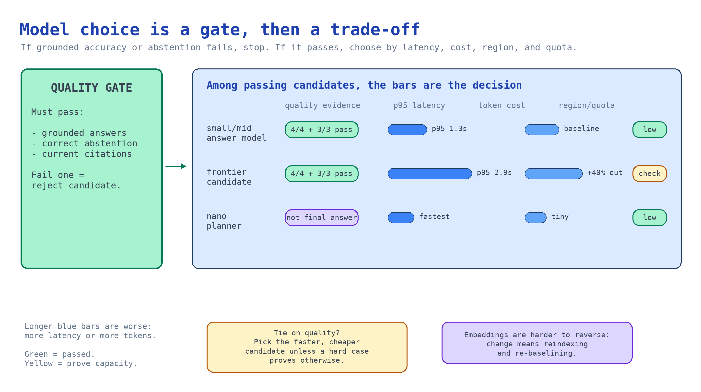

# Module 4 — Compare chat and embedding choices

You now have a real corpus and golden question set. Use them to choose models. Public benchmarks
measure a different workload.



## What you build

1. A comparison harness that runs the same golden questions through candidate chat deployments and
   reports quality, latency, and cost side by side.
2. An embedding decision based on retrieval quality, not dimension count.
3. A capacity and region plan for the live pilot.

## Choose your path

Make these decisions independently. Decide embeddings first. That choice constrains ingestion, and
changing it later means reindexing everything.

### Chat / query-planning model

| Option | Where it wins | Where it fails | Cost signal |
| --- | --- | --- | --- |
| **Small-to-mid model — `gpt-4.1-mini` class** *(default)* | Grounded answering over retrieved text; high volume; low latency | Multi-hop reasoning, ambiguous policy interpretation | Lowest per token |
| Frontier model — `gpt-5` class | Hard synthesis, adversarial phrasing, multi-source reconciliation | Cost and latency at pilot volume | Highest |
| Nano / micro — `gpt-4.1-nano`, `gpt-5-nano` class | Query planning and routing inside the retrieval pipeline | Final user-facing answers | Very low |
| Split: nano plans, mid answers | Best cost/quality ratio at volume | Two deployments to operate and evaluate | Low overall |

**Default: a small-to-mid model for answering.** In a grounded pipeline, the retrieved passage does
most of the work. Teams often overpay for a frontier model to summarize a paragraph the search index
already found. Measure before upgrading, and identify the golden questions that justify it.

Query planning inside a knowledge base has its own supported list: `gpt-4o`,
`gpt-4o-mini`, `gpt-4.1`, `gpt-4.1-mini`, `gpt-4.1-nano`, `gpt-5`, `gpt-5-mini`, `gpt-5-nano` on both
`2025-11-01-preview` and `2026-05-01-preview`; plus `gpt-5.1`, `gpt-5.2`, `gpt-5.4`, `gpt-5.4-mini`,
`gpt-5.4-nano` on `2026-05-01-preview` only.
Source: <https://learn.microsoft.com/azure/search/agentic-retrieval-how-to-create-knowledge-base>

Re-check that list at build time. Model availability moves faster than any lesson.

### Embedding model

| Option | Trade-off |
| --- | --- |
| **`text-embedding-3-large`** *(default)* | Best retrieval quality; larger vectors, higher index size and cost |
| `text-embedding-3-small` | Cheaper and smaller; measurably weaker on nuanced policy distinctions |
| Reduced dimensions on `-3-large` | Cuts index size while keeping most of the quality — measure the loss on your own corpus |

**Default: `text-embedding-3-large`.** Embedding costs occur at index and query time. For a policy
corpus this size, they are not the dominant cost. Everything downstream depends on retrieval quality.

**Migration cost.** Swapping the chat model is a config change plus an evaluation rerun: hours.
Swapping the embedding model invalidates every vector and needs a full reingest and new retrieval
baseline: days and a maintenance window. Choose embeddings deliberately, then leave them alone.

## Implementation

Both models were already deployed by module 1's Bicep, named by `AZURE_AI_MODEL_DEPLOYMENT_NAME` and
`AZURE_AI_EMBEDDING_DEPLOYMENT_NAME`. To compare, deploy a contrasting chat model alongside.

### Deploy a contrasting candidate

```bash
az cognitiveservices account deployment create \
  --name "$AZURE_AI_FOUNDRY_ACCOUNT_NAME" \
  --resource-group "$AZURE_RESOURCE_GROUP" \
  --deployment-name chat-candidate \
  --model-name gpt-4.1 \
  --model-format OpenAI \
  --sku-name GlobalStandard \
  --sku-capacity 30
```

Create model deployments on a single Cognitive Services account **serially**. Concurrent creates
conflict. Module 1 Bicep uses `dependsOn` for this reason.

Check regional capacity before you promise a model to anyone:

```bash
az cognitiveservices usage list --location "$AZURE_LOCATION" \
  --query "[?contains(name.value, 'OpenAI.GlobalStandard')].{name:name.value, used:currentValue, limit:limit}" -o table
```

Quota is per subscription, region, and SKU family. "The model is GA" does not mean "you can deploy
it here today."

### Run the comparison

[`accelerator/scripts/compare_models.py`](../accelerator/scripts/compare_models.py) runs every golden
question through each candidate deployment with identical grounding context. It reports these axes:

```python
response = openai.responses.create(
    model=deployment,
    instructions=system_instructions,
    input=f"Context:\n{context}\n\nQuestion: {case['question']}",
)
```

The context, instructions, and questions stay the same. Only the deployment changes. If prompts vary
between candidates, you measured the prompt, not the model.

```bash
python3 scenarios/ai-grounding/accelerator/scripts/compare_models.py \
  --deployments "$AZURE_AI_MODEL_DEPLOYMENT_NAME" chat-candidate
```

What it reports per deployment:

| Axis | How it is measured | Why it decides |
| --- | --- | --- |
| Grounded accuracy | Golden-question expected behaviour and citation match | The only axis that matters if it fails |
| Abstention | Does it decline the unanswerable case | A model that never abstains will confabulate in production |
| Superseded-document handling | Does it cite the current notice | Catches recency reasoning, not just retrieval |
| p50 / p95 latency | Wall clock per call | p95 is what users experience; p50 flatters everything |
| Tokens in / out | From the response usage | Multiply by volume for the real monthly number |

Judge the abstention and superseded cases first. Any competent model answers easy questions. The
difference between candidates appears when the right answer is "I don't know" or "not that document."

### Choosing PAYG or provisioned throughput

| Signal | Choose |
| --- | --- |
| Pilot, spiky or unknown volume | Pay-as-you-go standard — the default for everything in this scenario |
| Steady, predictable, high volume with a latency SLA | Provisioned throughput |
| Latency spikes and `429`s under normal pilot load | Fix concurrency and retries first; PTU is not a fix for a burst pattern |

Do not buy provisioned capacity during a pilot. You do not know your token profile yet. The comparison
produces the number you would use to size it.

## Verify

Public benchmarks measure a different workload. A leaderboard pick can guess on your corpus or stall
at p95 in production. Measure candidates side by side on your golden set.

**1. Both deployments you want to compare exist.**

```bash
az cognitiveservices account deployment list \
  --name "$AZURE_AI_FOUNDRY_ACCOUNT_NAME" --resource-group "$AZURE_RESOURCE_GROUP" \
  --query "[].name" -o tsv
```

Both names passed to `--deployments` must appear. A missing name later causes a
deployment-not-found error that looks like a harness bug.

**2. Run the comparison and read the table.**

```bash
python3 scenarios/ai-grounding/accelerator/scripts/compare_models.py \
  --deployments chat chat-candidate
```

```
deployment          grounded  abstained  p50(ms)  p95(ms)   tok_in  tok_out
chat                     4/4        3/3      820     1310     4912      611
chat-candidate           4/4        3/3     1640     2900     4912      844
```

`grounded` counts answerable questions cited correctly; `abstained` counts unanswerable questions the
model refused correctly. Four of seven golden questions are answerable. A model that grounds fewer is
guessing. One that abstains less than 3/3 answers questions the corpus cannot support. If candidates
tie on quality but differ by 2× latency and 40% more output tokens, decide. Record the choice and
what evidence would change it.

## Troubleshooting

| Symptom | Cause | Fix |
| --- | --- | --- |
| `429` on every call | Deployment capacity too low, or shared with another workload | Raise `--sku-capacity`, add exponential-backoff retries, reduce concurrency in the harness |
| Deployment create fails with a conflict | Concurrent deployments on one account | Create them serially |
| `InsufficientQuota` | Regional quota exhausted for that SKU family | Check `az cognitiveservices usage list`; request an increase or pick another region |
| Model not available in your region | Regional model availability differs | Check the model availability table on Learn before committing to a region |
| `401` / `403` from the SDK | Missing **Cognitive Services OpenAI User** on the Foundry resource, or no `az login` | Run `az login`; confirm the role assignment from module 1 landed |
| Candidate wins on quality but the harness is not reproducible | Temperature or prompt varied between runs | Fix the prompt, pin sampling parameters, re-run |
| Every candidate scores identically | Golden set is too easy | Add the hard cases: ambiguity, superseded documents, questions the corpus cannot answer |

## Decision record

Record the chat deployment and runner-up with their measured numbers, embedding model and its
full-reindex cost, region and quota headroom, PAYG/PTU decision and revisit volume, plus dated harness
output.

## Next module

[Module 5 — Build retrieval before adding an agent](05-grounded-retrieval.md) turns the corpus and
the models into a grounded answer with citations, abstention, and access-denied behaviour — still
with no agent in sight.
