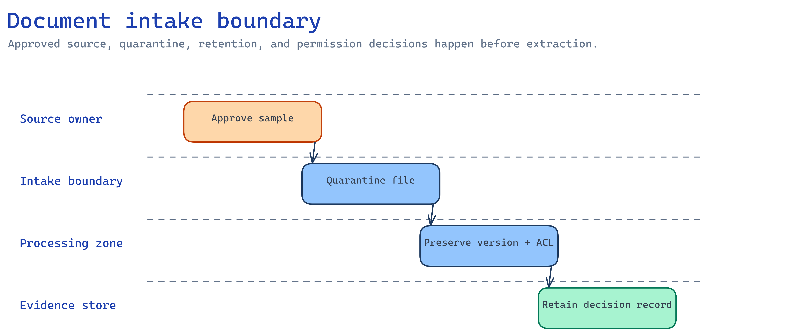

# Module 2 — Connect an approved document source

This module defines which documents can enter the workflow and how their identity, version, and
permissions stay with them. You can tune extraction later. An unapproved document is a governance
failure.



## What you build

1. A source decision: which system is authoritative for the documents you extract.
2. An intake contract: required metadata (source URI, version, owner, hash, sensitivity) and rules
   that route documents to quarantine.
3. A **runnable intake check** that confirms the plan is complete and containers are private and
   keyless.

## Choose your path

| Option | Reaches | Permission model | Build effort | Status |
| --- | --- | --- | --- | --- |
| **A. Azure Blob Storage** *(default)* | Files you upload / land via pipeline | RBAC on the container; account MI reads by URL | Low | GA |
| B. ADLS Gen2 | Hierarchical lake data | POSIX ACLs (≤32 per file) + RBAC; ACLs can carry forward to a search index | Medium | GA |
| C. SharePoint | Documents users already own | Inherited M365 / Entra permissions; indexer or Graph | Medium | Indexed = preview, Remote = preview |
| D. OneLake (lakehouse) | Fabric lakehouse files | Fabric workspace RBAC | Medium | GA as a knowledge source |

**Default: Option A.** Blob is the simplest approved-content boundary: one RBAC-controlled container
the account's managed identity reads by URL, plus a quarantine container. Content Understanding and
Document Intelligence both accept blob URLs directly, so the analyzer needs no extra pipeline.

**Choose B when** documents already live in a data lake and require directory-level ACLs. **Choose C
when** documents belong in SharePoint and their owners should manage permissions there. Do not copy
them to Blob and create a second permission model. **Choose D when** documents are curated with
analytical data in a Fabric lakehouse.

**Migration cost.** Moving from A to B, C, or D changes the ingestion step and `source_kind` in the
intake plan. Extraction and review still read the same typed result. Moving from C to A also requires
a copy and new permission design, so avoid it unless there is a clear reason.

### The intake decision, stated precisely

Answer these before you write code:

1. **Which system is authoritative** for each document class, and who owns it?
2. **What metadata must travel** with every document — source URI, version, ingested-by, SHA-256,
   sensitivity label, permission owner IDs?
3. **What sends a document to quarantine** — unapproved class, unauthorized source, unsupported type
   or size, missing sensitivity label?
4. **How long is a document retained**, and who signed off on that window?

Capture the answers in [`accelerator/sample-data/workflow/intake-plan.json`](../accelerator/sample-data/workflow/intake-plan.json).

## Implementation

### Option A — Azure Blob Storage (default)

The template already created `documents-inbound` and `documents-quarantine` with shared-key access
off. Upload approved documents keylessly and stamp intake metadata as blob metadata:

```bash
ACCOUNT=$(grep AZURE_STORAGE_ACCOUNT_NAME accelerator/.env | cut -d= -f2)

az storage blob upload \
  --account-name "$ACCOUNT" --auth-mode login \
  --container-name documents-inbound \
  --name invoice-2002.pdf --file ./invoice-2002.pdf \
  --metadata source_uri="procurement/2026/invoice-2002.pdf" source_version="1" \
             ingested_by="$(az ad signed-in-user show --query userPrincipalName -o tsv)" \
             sensitivity_label="Confidential"
```

Route anything that fails a rule to `documents-quarantine`, never `documents-inbound`. The account's
managed identity has **Storage Blob Data Reader** from module 1, so analyzers read
`https://<account>.blob.core.windows.net/documents-inbound/<name>` by URL without a key.

### Option B — ADLS Gen2

Same storage account with hierarchical namespace enabled. Set directory ACLs so permissions travel
with the document, and record that you will carry them forward when the content is indexed:

```bash
az storage fs access set \
  --account-name "$ACCOUNT" --auth-mode login \
  --file-system documents-inbound --path procurement \
  --acl "user::rwx,group::r-x,other::---"
```

Know the limit before you promise anything: **≤32 ACL entries per file/directory**. Past that,
redesign to group-based permissions. Reference:
<https://learn.microsoft.com/azure/search/search-indexer-access-control-lists-and-role-based-access>

### Option C — SharePoint

Keep documents in SharePoint. Connect the library and let M365 enforce permissions for the signed-in
user. As a knowledge source, SharePoint is available **indexed** (ingested before query time) or
**remote** (fetched at query time). For document extraction, you typically use Microsoft Graph to
retrieve a specific file, then give its bytes or short-lived URL to the analyzer.

Confirm that library permissions reflect intent. Inherited permissions on a "public" site are a
common surprise. Test with a low-privilege account. Reference:
<https://learn.microsoft.com/azure/search/agentic-knowledge-source-overview>

### Option D — OneLake (lakehouse)

When documents are curated in a Fabric lakehouse, reference the OneLake path and let Fabric workspace
RBAC govern access. OneLake is a GA knowledge source kind; permissions are enforced by Fabric, not
copied into a separate store. Reference: <https://learn.microsoft.com/fabric/iq/overview>

## Verify

Check the source boundary against your own storage account, not against a plan file.

**1. Both containers exist and neither is public.**

```bash
for C in "$AZURE_DOCUMENTS_CONTAINER_NAME" "$AZURE_QUARANTINE_CONTAINER_NAME"; do
  az storage container show --account-name "$AZURE_STORAGE_ACCOUNT_NAME" \
    --name "$C" --auth-mode login --query "{name:name, public:properties.publicAccess}" -o tsv
done
```

You want both names with an empty `public` column. A value of `blob` or `container` exposes the
document corpus anonymously. If the command succeeds, Entra data-plane access works.
`AuthorizationFailure` means your identity still lacks **Storage Blob Data Contributor**.

**2. Intake metadata actually rode with the document.**

```bash
az storage blob metadata show --account-name "$AZURE_STORAGE_ACCOUNT_NAME" --auth-mode login \
  --container-name "$AZURE_DOCUMENTS_CONTAINER_NAME" --name invoice-2002.pdf -o json
```

You should see `source_uri`, `source_version`, `ingested_by`, and `sensitivity_label`. Missing values
mean the pipeline cannot trace the document's origin or who admitted it.

**3. The analyzer identity can read inbound documents by URL.**

```bash
ACCOUNT=$(echo "$AZURE_CONTENT_UNDERSTANDING_ENDPOINT" | sed -E 's#https?://([^.]+)\..*#\1#')
MI=$(az cognitiveservices account show --name "$ACCOUNT" \
  --resource-group "$(az cognitiveservices account list --query "[?name=='$ACCOUNT'].resourceGroup | [0]" -o tsv)" \
  --query identity.principalId -o tsv)
STORAGE_ID=$(az storage account show --name "$AZURE_STORAGE_ACCOUNT_NAME" --query id -o tsv)
az role assignment list --assignee "$MI" --scope "$STORAGE_ID" \
  --query "[].roleDefinitionName" -o tsv
```

You need **Storage Blob Data Reader** in that list. Without it, module 3's analyze-by-URL call fails
against the blob.

## Troubleshooting

| Symptom | Cause | Fix |
| --- | --- | --- |
| `403` on `az storage blob upload` | Missing **Storage Blob Data Contributor** on your identity | Assign it at the storage scope; wait ~5 min; use `--auth-mode login` |
| Analyzer can't read the blob later | Account MI lacks **Storage Blob Data Reader** | Module 1's role assignment covers this; confirm it exists |
| `AuthorizationFailure` with `--account-key` | Shared key access is disabled by design | Use `--auth-mode login`, never a key |
| SharePoint returns nothing for some users | Inherited site permissions differ from intent | Fix permissions in SharePoint; retest with a low-privilege account |
| Revoked user still reaches indexed content | ACL staleness after ingestion | Resync the indexer; parent-scope changes need a full resync |
| Documents pile up unprocessed | No quarantine rule caught an unapproved class | Add the rule to the intake plan; route failures to `documents-quarantine` |

## Decision record

Keep one page with the pilot: the selected source and why alternatives lost, metadata contract,
quarantine rules, retention window and approver, plus dated intake-check results.

## Next module

[Module 3 — Select the extraction capability](03-extraction-selection.md) chooses how these
documents become typed fields, across every Microsoft option.
