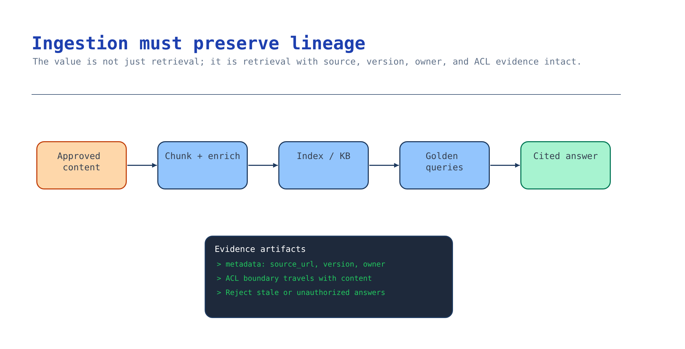

# Module 3 — Ingest and index approved content

Module 2 chose *where* knowledge lives. This module makes it retrievable, with the source metadata
that makes an answer auditable and the refresh behaviour that keeps it from going stale.

The failure this module prevents is the expensive one: a confident, well-cited answer quoting a
policy that was superseded three months ago.



## What you build

1. An ingestion path from the approved source into a retrievable store.
2. Chunking, embedding, and metadata that survive into the answer as a citation.
3. A refresh schedule, and a documented worst-case staleness window.
4. A retrieval smoke test proving the corpus answers the questions it should — and returns nothing
   for the questions it should not.

## Choose your path

| Option | Who writes the pipeline | Chunking control | Freshness model | Effort |
| --- | --- | --- | --- | --- |
| **A. Foundry IQ managed ingestion** *(default)* | The platform — data source, skillset, indexer, and index are generated for you | Platform-chosen; `contentExtractionMode` is your main lever | `ingestion_schedule` on the knowledge source | Lowest |
| B. Azure AI Search indexer (pull) | You define the index + skillset; the indexer runs it | Full, via a split skill in the skillset | Indexer schedule + change detection | Medium |
| C. Push API with custom chunking | You, entirely — your code chunks, embeds, and uploads | Total | You own it; nothing runs unless you run it | High |
| D. Content Understanding preprocessing, then B or C | You, plus a preprocessing pass | Total, over a much richer extraction | Two-stage | Highest |
| E. Remote knowledge source — no ingestion at all | Nobody | N/A — nothing is chunked | Always fresh by construction | Lowest |

**Default: Option A.** You did not choose Foundry IQ in module 2 to then hand-build an indexer. A
blob knowledge source auto-generates the data source, skillset, indexer, and index, and carries
permission metadata forward when you ask it to. That is weeks of pipeline work you do not do.

**Choose B when** you need a specific field schema, a scoring profile, or a custom skill in the
enrichment pipeline, but still want scheduled pull ingestion. It is the classic, well-documented
path, and an index you build this way can later be wrapped as a *search index knowledge source*, so
B → A stays cheap.

**Choose C when** your content is not sitting in a supported store — it comes out of an API, a
database join, or a CMS — or when chunk boundaries are load-bearing. Contracts, legal clauses, and
numbered policy documents often are. You pay for it by owning refresh forever.

**Choose D when** the source is not really text: scanned PDFs, forms, tables, screenshots. Extract
structure first, index the structured output. Do not feed raw OCR sludge into an index and hope
semantic ranking rescues it.

**Choose E when** the content changes faster than any schedule can chase, or when the platform that
owns it already answers questions well (SharePoint, a Fabric data agent, Work IQ). Remote sources
are slower per query and always current. For live operational data this is the only correct answer.

**Migration cost.** A → B is moderate: you rebuild the pipeline but keep the knowledge base and the
agent. B → A is cheap. C → anything is expensive because your chunking assumptions are usually baked
into your evaluation set too. Mixing is normal and supported — one knowledge base can hold an
indexed blob source *and* a remote SharePoint source, and all sources flow through the same ranking
pipeline.

### The four things that must survive ingestion

Whatever option you pick, every retrievable chunk needs these, or the answer is unauditable:

| Field | Why | Failure if missing |
| --- | --- | --- |
| `source` / document id | The citation the user clicks | "Trust me" answers |
| Version or effective date | Lets the model prefer the current policy | Confident answers from superseded documents |
| Permission metadata (`userIds` / `groupIds`) | Query-time ACL filtering (module 2) | Everyone sees everything |
| Chunk position / parent doc | Lets a reviewer find the passage in context | Reviewers cannot verify a disputed answer |

## Implementation

Use the current Microsoft Learn guidance for the active ingestion and indexing surface.

Seed the approved container with the scenario's fictional corpus first. It is deliberately small and
contains a superseded notice and a restricted document, so it exercises both freshness and
permissions:

```bash
az storage blob upload-batch \
  --account-name "$AZURE_STORAGE_ACCOUNT_NAME" \
  --auth-mode login \
  --destination "$AZURE_STORAGE_CONTAINER_NAME" \
  --source scenarios/ai-grounding/accelerator/sample-data \
  --pattern "*.md"
```

The account is provisioned with `allowSharedKeyAccess: false`, so `--auth-mode login` is required —
there is no account key to fall back to. That is intentional.

### Option A — Foundry IQ managed ingestion (blob knowledge source)

The knowledge source generates the whole pipeline. You supply the container, the two models, and the
ingestion parameters.

```bash
pip install --pre azure-search-documents azure-identity python-dotenv
```

Preview (`2026-05-01-preview`) is required for query planning, answer synthesis, and ACL carry-
forward. The GA surface (`2026-04-01`) gives minimal extractive retrieval only.

[`accelerator/scripts/build_knowledge_source.py`](../accelerator/scripts/build_knowledge_source.py):

```python
from azure.search.documents.indexes.models import (
    AzureBlobKnowledgeSource, AzureBlobKnowledgeSourceParameters,
    KnowledgeBaseAzureOpenAIModel, AzureOpenAIVectorizerParameters,
    KnowledgeSourceAzureOpenAIVectorizer, KnowledgeSourceContentExtractionMode,
    KnowledgeSourceIngestionParameters,
)

knowledge_source = AzureBlobKnowledgeSource(
    name="approved-content-ks",
    azure_blob_parameters=AzureBlobKnowledgeSourceParameters(
        connection_string=blob_connection,
        container_name=os.environ["AZURE_STORAGE_CONTAINER_NAME"],
        is_adls_gen2=False,
        ingestion_parameters=KnowledgeSourceIngestionParameters(
            chat_completion_model=KnowledgeBaseAzureOpenAIModel(
                azure_open_ai_parameters=AzureOpenAIVectorizerParameters(
                    resource_url=os.environ["AZURE_AI_FOUNDRY_ENDPOINT"],
                    deployment_name=os.environ["AZURE_AI_MODEL_DEPLOYMENT_NAME"],
                    model_name=os.environ["AZURE_AI_CHAT_MODEL_NAME"],
                )),
            embedding_model=KnowledgeSourceAzureOpenAIVectorizer(
                azure_open_ai_parameters=AzureOpenAIVectorizerParameters(
                    resource_url=os.environ["AZURE_AI_FOUNDRY_ENDPOINT"],
                    deployment_name=os.environ["AZURE_AI_EMBEDDING_DEPLOYMENT_NAME"],
                    model_name=os.environ["AZURE_AI_EMBEDDING_MODEL_NAME"],
                )),
            content_extraction_mode=KnowledgeSourceContentExtractionMode.MINIMAL,
            ingestion_permission_options=["user_ids", "group_ids"],
        ),
    ),
)
index_client.create_or_update_knowledge_source(knowledge_source)
```

Then the knowledge base that references it:

```python
knowledge_base = KnowledgeBase(
    name=os.environ["AZURE_KNOWLEDGE_BASE_NAME"],
    knowledge_sources=[KnowledgeSourceReference(name="approved-content-ks")],
    retrieval_instructions=(
        "Use approved-content-ks for questions about returns policy, exceptions, "
        "and current service notices. Prefer the most recent effective date."
    ),
    answer_instructions=(
        "Answer only from retrieved documents and cite the document id. "
        "If the documents do not contain the answer, say so plainly."
    ),
    output_mode="answerSynthesis",
    models=[KnowledgeBaseAzureOpenAIModel(azure_open_ai_parameters=chat_params)],
    retrieval_reasoning_effort=KnowledgeRetrievalLowReasoningEffort(),
)
index_client.create_or_update_knowledge_base(knowledge_base)
```

Run it:

```bash
export AZURE_KNOWLEDGE_BASE_NAME=grounding-kb
python3 scenarios/ai-grounding/accelerator/scripts/build_knowledge_source.py
```

**Four rules the API enforces**, and one it does not:

1. Create the knowledge source **before** the knowledge base.
2. A knowledge base and its sources must live on the **same search service**.
3. To delete a source, first update or delete every knowledge base referencing it.
4. `retrieval_instructions` is how you steer a multi-source base. With one source it barely matters;
   with five it is the difference between routing and guessing. Write it now anyway.
5. *(Not enforced)* Nothing stops you shipping without `ingestion_permission_options`. Module 2's
   probe is what catches that.

The generated objects are reported back under `azureBlobParameters.createdResources` —
`datasource`, `indexer`, `skillset`, `index`. Record those names; they are what you inspect in the
portal when ingestion misbehaves, and what you delete when you tear down.

**Freshness.** Set `ingestion_schedule` on the ingestion parameters. Pick the interval from the
staleness window the data owner signed in module 2, not from a default. If the answer to "how stale
can this be" was "never more than an hour", a nightly indexer is a broken promise.

### Option B — Azure AI Search indexer (pull)

You define the index, skillset, and indexer explicitly. This is the path
[`activities/foundations`](../../../activities/foundations/README.md) Step 4 walks in full, against
the university FAQ corpus — build it there first if this is new, then bring the pattern here.

The shape that matters:

- An index with a **retrievable `content` field** (what the model reads), a **retrievable `source`
  field** (the citation), a filterable effective-date field, and filterable `userIds` / `groupIds`
  collections if you are enforcing ACLs.
- A skillset containing a **split skill** (your chunking policy, made explicit) and an embedding
  skill pointing at your embedding deployment.
- An indexer with a schedule and change detection.

Chunking guidance that holds up in practice: moderate chunks with light overlap, and never split
across a rule boundary. In this scenario's corpus the return window, the proof-of-purchase
requirement, and the order-record check belong to one rule — a chunk boundary through the middle of
them produces answers that are individually true and collectively wrong.

### Option C — Push API with custom chunking

Your code owns everything. Use `SearchClient.upload_documents()` with chunks you produced yourself,
each carrying `content`, `source`, effective date, chunk index, parent document id, and permission
fields.

This is the only option where you can implement structure-aware chunking — split on headings, keep a
numbered clause intact, attach the section title to every chunk so a retrieved fragment still says
what it is about.

The cost is permanent: no indexer means no schedule, no change detection, and no ACL resync. When a
document changes you must re-chunk and re-upload it, and when a permission changes you must reingest
the affected documents. Put that in a job with monitoring on day one, or it will silently stop
running in month three.

### Option D — Content Understanding preprocessing

When the source is scanned, tabular, or visual, extract structure first, then index the structured
output through B or C. The document workflow scenario in this kit covers extraction in depth; here
you only need the output contract: typed fields plus evidence spans, which become your `content` and
your citation anchor.

The tell that you need this: retrieval "works" but every answer about a table or a form is subtly
wrong. That is not a ranking problem and no amount of reranking will fix it.

### Option E — Remote knowledge source (no ingestion)

Add the source to the knowledge base and skip this module's pipeline entirely. Remote SharePoint,
Fabric Data Agent, Fabric Ontology, MCP server, Work IQ, and Web are all fetched at query time
through the owning platform's API and never stored in Search.

You trade latency for correctness-by-construction: no chunking decisions, no refresh schedule, no
ACL staleness window. For anything that changes hourly — inventory, case status, live metrics — this
is the right answer, and indexing it instead is the most common serious mistake in this scenario.

## Verify

The expensive mistake here is querying before asynchronous ingestion has finished. An empty result
then looks like a retrieval bug and sends you debugging the wrong layer. Confirm the indexer actually
completed before you trust any query.

**1. The knowledge source and base were created.** `build_knowledge_source.py` prints one line per
object it creates or updates.

```bash
python3 scenarios/ai-grounding/accelerator/scripts/build_knowledge_source.py
```

You want `knowledge source '...' created or updated` and `knowledge base '...' created or updated`.
A `403` on the source means the deployer principal is missing **Search Service Contributor** or
**Search Index Data Contributor**; a `403` once the source touches a model means the search service
managed identity lacks **Cognitive Services User** on the Foundry account.

**2. The auto-generated indexer finished, and processed every document.** The blob knowledge source
generates its own indexer, named after the source. Read its status directly, keyless:

```bash
TOKEN=$(az account get-access-token --scope https://search.azure.com/.default --query accessToken -o tsv)

# Find the generated indexer name (it is prefixed with the knowledge source name).
curl -s -H "Authorization: Bearer $TOKEN" \
  "$AZURE_SEARCH_ENDPOINT/indexers?api-version=2026-04-01&\$select=name" \
  | python3 -c "import sys,json;[print(i['name']) for i in json.load(sys.stdin)['value']]"

# Then read its execution status.
curl -s -H "Authorization: Bearer $TOKEN" \
  "$AZURE_SEARCH_ENDPOINT/indexers('<generated-indexer-name>')/search.status?api-version=2026-04-01" \
  | python3 -c "import sys,json;r=json.load(sys.stdin)['lastResult'];print(r['status'], r['itemsProcessed'], 'processed', r['itemsFailed'], 'failed')"
```

`success` with `itemsProcessed` equal to the number of approved documents and `0` failed is the
signal to move on. `inProgress` means ingestion is still running — wait and re-read, do not query
yet. This is the check that stops you from concluding "retrieval is broken" when ingestion simply had
not finished.

**3. The index actually holds documents.** A `success` status with zero documents means the indexer
ran before the blobs were uploaded.

```bash
curl -s -H "Authorization: Bearer $TOKEN" \
  "$AZURE_SEARCH_ENDPOINT/indexes('<generated-index-name>')/docs/\$count?api-version=2026-04-01"
```

A non-zero count that matches your corpus is what you want. Zero after a successful run means re-run
the indexer once content is in the container.

## Troubleshooting

| Symptom | Cause | Fix |
| --- | --- | --- |
| `403` creating a knowledge source | Missing **Search Service Contributor**, or **Search Index Data Contributor** when the source generates an indexer pipeline | Assign both on the search service; the Bicep from module 1 does this for the deployer principal |
| `403` when the source uses a model | The **search service managed identity** lacks **Cognitive Services User** on the Foundry resource | Assign it; note this also requires search tier **Basic or higher** — the free tier cannot use a managed identity for model access |
| Ingestion succeeds, retrieval returns nothing | Indexer ran before the blobs were uploaded | Re-run the indexer; check `createdResources.indexer` execution history in the portal |
| Answers cite a superseded document | No effective-date field, or no `retrieval_instructions` preferring recency | Add the date as a retrievable field and say so in `retrieval_instructions`; archive superseded content out of the container |
| `ImportError` on `KnowledgeSourceIngestionParameters` | GA vs preview module split | Preview: `azure.search.documents.indexes.models`. GA: `azure.search.documents.knowledgebases.models`. Confirm with `pip show azure-search-documents` |
| Cannot delete a knowledge source | A knowledge base still references it | Update or delete the knowledge base first |
| Chunks return fragments with no context | Chunking split mid-rule, or no section title carried into the chunk | Prepend the heading path to each chunk (Option C), or raise chunk size and overlap (Option B) |
| Ingestion cost is higher than expected | Embeddings are billed at index time *and* query time | Reduce reingestion frequency; do not reingest unchanged documents |

## Decision record

The ingestion option and why; the chunking policy in one sentence, with the rule boundary it
protects; which metadata fields carry into citations; the refresh schedule and the resulting
worst-case staleness window, matched against what the data owner signed in module 2; the API version;
and the golden-question result with a date.

## Next module

[Module 4 — Compare chat and embedding choices](04-model-selection.md) picks the models, now that
you have a real corpus to measure them against instead of a vendor benchmark.
