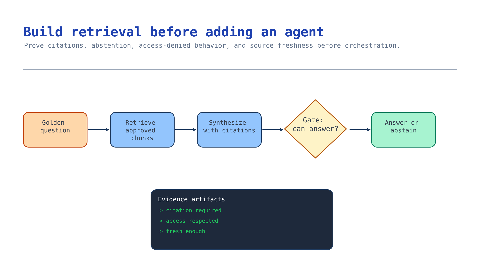

# Module 5 — Build retrieval before adding an agent

Most grounding projects fail here and find out three modules later. An agent wrapped around weak
retrieval does not fix weak retrieval; it makes the failure fluent and harder to spot.

So this module ships a working grounded answer path — citations, abstention, access-denied
behaviour, freshness — with **no agent**. If it does not work here, an agent will not save it.



## What you build

1. A retrieval call that returns passages with citations.
2. An answer path that cites, abstains when the corpus is silent, and stays silent about documents
   the caller cannot see.
3. A measured retrieval baseline — recall@k on the golden set — that later modules must not regress.

## Choose your path

| Option | Retrieval intelligence | Where the answer is composed | Best for |
| --- | --- | --- | --- |
| **A. Knowledge base retrieval with `answerSynthesis`** *(default)* | Query planning, parallel subqueries, semantic reranking, answer synthesis — all managed | Inside the knowledge base | Multi-source, ambiguous, multi-part questions |
| B. Knowledge base retrieval, extractive only | Managed retrieval and ranking | Your code | You want the passages and full control of the prompt |
| C. Direct hybrid query against an AI Search index | Whatever you configure: vector + keyword + semantic reranker | Your code | Maximum control; a single well-understood index |
| D. Keyword-only search | None | Your code | Exact-match lookups: ids, codes, SKUs |

**Default: Option A.** You built the knowledge base in module 3; `output_mode="answerSynthesis"`
returns a cited answer directly, and query planning decomposes a compound question into subqueries
that run in parallel and get reranked together. That decomposition is exactly what a naive single
vector query gets wrong.

**Choose B when** you need to own the answer prompt — a required response format, a regulated
disclaimer, a domain-specific abstention rule. You still get the managed retrieval and ranking.

**Choose C when** you are on the direct-Search path from module 2, or when you need a scoring
profile or filter the knowledge base does not expose. Use **hybrid** (vector + keyword) with the
semantic reranker on. Vector-only search silently fails on exact identifiers; keyword-only fails on
paraphrase. Nearly every real corpus needs both.

**D is not a whole solution**, but it is the right tool for one job: looking up a known identifier.
`RET-POL-2026-01` should be found by matching, not by embedding similarity.

**Reasoning effort is a real dial**, verified 2026-07-24: `minimal` skips query planning and issues
queries directly, `low` is the default, `medium` plans harder. Start at `low`, and only move to
`medium` if the golden set shows compound questions failing. `minimal` is for latency-critical paths
where questions are simple and singular.

**Migration cost.** A ↔ B is a parameter change. A/B → C is a rewrite of the retrieval layer but the
evaluation set and the corpus survive. Any change here re-baselines your metrics, so lock this before
module 7.

## Implementation

Verified against Microsoft Learn on **2026-07-24**.

### Option A — Knowledge base retrieval with answer synthesis

[`accelerator/scripts/grounded_answer.py`](../accelerator/scripts/grounded_answer.py):

```python
from azure.identity import DefaultAzureCredential
from azure.search.documents.knowledgebases import KnowledgeBaseRetrievalClient
from azure.search.documents.knowledgebases.models import (
    KnowledgeBaseRetrievalRequest, KnowledgeBaseMessage, KnowledgeBaseMessageTextContent,
)

client = KnowledgeBaseRetrievalClient(
    endpoint=os.environ["AZURE_SEARCH_ENDPOINT"],
    knowledge_base_name=os.environ["AZURE_KNOWLEDGE_BASE_NAME"],
    credential=DefaultAzureCredential(),
)

request = KnowledgeBaseRetrievalRequest(
    messages=[KnowledgeBaseMessage(
        role="user",
        content=[KnowledgeBaseMessageTextContent(text=question)],
    )],
)

result = client.retrieve(request)
print(result.response[0].content[0].text)
```

To enforce the module 2 permission boundary, pass the end user's token — never skip this in an app
that serves more than one person:

```python
result = client.retrieve(
    request,
    headers={"x-ms-query-source-authorization": user_token},
)
```

Answer behaviour is steered by `answer_instructions` on the knowledge base (module 3), not by a
prompt here. Make the abstention rule explicit there:

```
Answer only from retrieved documents and cite the document id.
If the retrieved documents do not contain the answer, reply exactly:
"I don't have approved information on that." Do not infer, and do not use general knowledge.
```

"Do not infer" is doing real work in that instruction. Without it a model will happily bridge two
adjacent policy rules into a third rule that does not exist.

### Option B — Extractive retrieval, your own answer prompt

Same client, no synthesis. Set `output_mode` to extractive on the knowledge base, take the retrieved
passages, and compose the answer yourself:

```python
passages = [ref for ref in result.references]
context = "\n\n".join(f"[{p.source_data['source']}] {p.source_data['content']}" for p in passages)

answer = openai.responses.create(
    model=os.environ["AZURE_AI_MODEL_DEPLOYMENT_NAME"],
    instructions=(
        "Answer only from the numbered context. Cite the bracketed source id for every claim. "
        "If the context does not answer the question, say you have no approved information."
    ),
    input=f"Context:\n{context}\n\nQuestion: {question}",
)
```

Inspect the actual shape of `result.references` in your SDK version before relying on field names —
the response model differs between the GA and preview surfaces.

### Option C — Direct hybrid query against the index

```python
from azure.search.documents import SearchClient
from azure.search.documents.models import VectorizableTextQuery

search = SearchClient(
    endpoint=os.environ["AZURE_SEARCH_ENDPOINT"],
    index_name=os.environ["AZURE_SEARCH_INDEX_NAME"],
    credential=DefaultAzureCredential(),
)

results = search.search(
    search_text=question,                     # keyword half of the hybrid query
    vector_queries=[VectorizableTextQuery(    # vector half, embedded server-side
        text=question, k_nearest_neighbors=50, fields="contentVector",
    )],
    query_type="semantic",                    # semantic reranker over the merged set
    semantic_configuration_name="default",
    top=5,
    select=["content", "source", "effectiveDate"],
)
```

Three things people get wrong here, in order of frequency:

1. **Vector-only retrieval.** It cannot find `RET-POL-2026-01`. Always send `search_text` too.
2. **`top` used as the retrieval depth.** Retrieve wide (`k_nearest_neighbors=50`), rerank, then
   return `top=5`. Retrieving 5 and reranking 5 reranks nothing.
3. **Semantic ranking left off.** It is the single largest quality lever in the pipeline, and the
   search service must be provisioned with semantic search enabled — module 1's Bicep sets
   `semanticSearch: 'standard'`.

The [foundations activity](../../../activities/foundations/README.md) Step 4 builds this path
end-to-end against the university FAQ corpus, including attaching the index to an agent with
`AzureAISearchQueryType.SEMANTIC` and `top_k=5`. Use it as the working reference.

### The three behaviours you must implement, not hope for

**Citations.** Every claim carries a source id. Enforce it in the instruction and assert it in the
test — a model told to cite will usually cite, and "usually" is not a control.

**Abstention.** The golden set has a question the corpus cannot answer. The correct response is a
plain refusal. A grounded assistant that never says "I don't know" is not grounded, it is
well-decorated.

**Access-denied silence.** When retrieval returns nothing because the caller lacks permission, the
answer must be indistinguishable from "no information exists" — no title, no snippet, no "there is a
supervisor document but you cannot see it". That last one is a leak with a polite tone.

**Freshness.** The corpus has a superseded Alpine District notice alongside the current one. The
answer must cite the current one. If both come back ranked together, filter by effective date at
query time rather than hoping the ranker prefers recency — it does not.

## Verify

```bash
# Offline: prompt contract, abstention rule, and golden-set structure
python3 scenarios/ai-grounding/accelerator/scripts/grounded_answer.py --offline

# Live: every golden question, with citation, abstention, and recency assertions
python3 scenarios/ai-grounding/accelerator/scripts/grounded_answer.py \
  --knowledge-base "$AZURE_KNOWLEDGE_BASE_NAME" --all
```

Expected:

```
✅ Module 5 checkpoint PASS — 4/4 cited, 3/3 abstained, recall@5 baseline recorded
```

Record `recall@5` as your baseline. Modules 6 and 7 must not regress it, and "we added an agent and
retrieval got worse" is a real, common, and otherwise invisible outcome.

## Troubleshooting

| Symptom | Cause | Fix |
| --- | --- | --- |
| Empty results for questions you know are answerable | Ingestion incomplete, or querying the wrong knowledge base / index name | Re-run module 3's verification; confirm the indexer finished |
| Exact ids like `RET-POL-2026-01` never found | Vector-only query | Send `search_text` alongside `vector_queries` |
| Good passages retrieved, bad answer | Answer prompt permits inference | Add "answer only from the context; do not infer" and re-test the abstention case |
| Model answers the unanswerable question | No abstention rule, or a rule the model can rationalise around | Specify the exact refusal string and assert on it |
| Superseded document cited | No recency filter or instruction | Filter on effective date; state the recency preference in `retrieval_instructions` |
| `semantic` query type rejected | Semantic ranker not enabled on the service | Provision with `semanticSearch: 'standard'`; the free tier is also limited |
| `401` / `403` on retrieve | Missing data-plane role, or no `az login` | Assign **Search Index Data Reader** to the caller; run `az login` |
| Latency far above expectation | `medium` reasoning effort, or a remote knowledge source in the base | Drop to `low`; remote sources are fetched live at query time and are inherently slower |
| Everything passes but real users complain | Golden set reflects what you built, not what they ask | Collect 20 real questions and add the ones that fail |

## Decision record

The retrieval option and reasoning effort; the abstention string and where it is enforced; the
recency strategy; the measured `recall@5` baseline with a date; and — stated explicitly — whether the
pilot needs an agent at all, because if this module already answers the customer's question, module 6
is optional and shipping now is the better decision.

## Next module

[Module 6 — Add agent and live-data routing only when justified](06-agent-and-routing.md) adds an
agent, but only after you have written down what it buys you that this module does not.
