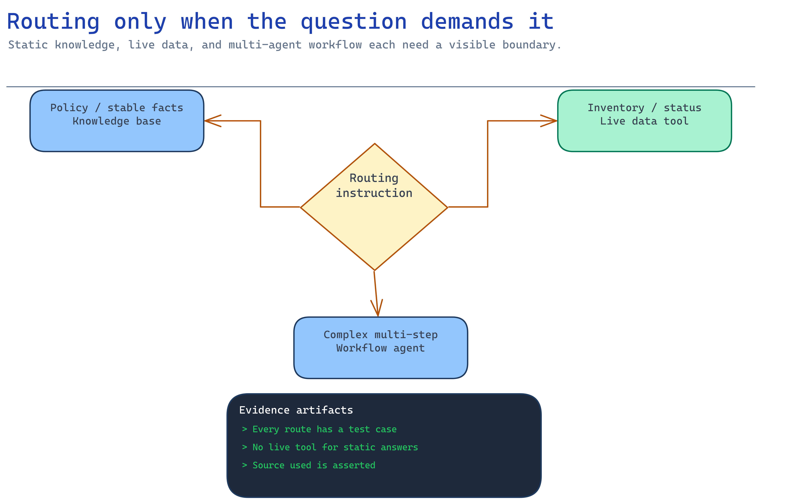

# Module 6 — Add agent and live-data routing only when justified

Module 5 produced a working grounded answer. An agent is not the next step by default; it is a step
you take when you can name what it adds. This module makes you name it, then builds it properly.



## What you build

1. A written justification — or a decision not to build an agent, which is a legitimate outcome.
2. An agent with explicit source-routing rules across knowledge and live data.
3. A routing test proving policy questions and live-data questions reach different sources.

## Choose your path

Start with the test that decides whether to continue.

**You do not need an agent if:** one knowledge source answers everything, the interaction is
single-turn question-and-answer, no action is taken on the user's behalf, and no live system is
consulted. Module 5 already shipped what you need. Deploy it and move to module 7.

**You need an agent when** at least one of these is true: the assistant must choose between sources,
it must call a live system, it must take an action, or it must hold multi-turn state. Anything else
is architecture for its own sake.

| Option | What it adds | Cost | When it wins |
| --- | --- | --- | --- |
| No agent — module 5's retrieval path | Nothing; ships today | None | Single-source Q&A. Genuinely common; genuinely underused |
| **A. Foundry agent + knowledge tool** *(default when an agent is justified)* | Multi-turn, versioned, traceable, tool-capable | Low — one API surface | The normal case |
| B. Multi-source routing inside one knowledge base | Retrieval instructions steer across sources; one call, merged ranking | Low | Sources are all *knowledge*, not systems |
| C. Agent + separate live-data tool (Fabric IQ, MCP, OpenAPI) | Explicit routing between "what the policy says" and "what is true right now" | Medium | Live operational data is in play |
| D. Multi-agent workflow | Specialist agents with a planner | High — orchestration, latency, debugging | Genuinely distinct specialisations. Rarely justified in a pilot |

**Default: Option A**, extended with C when live data is required. Use B *inside* A whenever your
extra sources are documents rather than systems — one knowledge base with good
`retrieval_instructions` beats three tools the agent has to choose between.

**Avoid D in a pilot.** Multi-agent orchestration multiplies latency, cost, and failure modes, and
customers rarely evaluate it honestly against a single well-instructed agent. If it is genuinely
needed, the `extra-magentic-workflows` activity covers it — but earn it first.

**The rule that keeps this correct:** index knowledge, route to systems. A policy document belongs in
the knowledge base. Case status, inventory, and live metrics belong behind a tool that is called at
question time. Indexing live data produces confidently cited stale numbers — the most damaging
failure in this whole scenario, because it looks exactly like a correct answer.

**Migration cost.** No-agent → A is cheap; retrieval and evaluations carry over. A → C is additive.
A/C → D is a redesign and a re-baseline of every metric.

## Implementation

Use the repo's validator-backed activity code and current Microsoft Learn guidance.

### Option A — Foundry agent with a knowledge tool

```python
import os
from azure.ai.projects import AIProjectClient
from azure.ai.projects.models import (
    PromptAgentDefinition,
    AzureAISearchTool, AzureAISearchToolResource,
    AISearchIndexResource, AzureAISearchQueryType,
)
from azure.identity import DefaultAzureCredential

project = AIProjectClient(
    endpoint=os.environ["AZURE_AI_PROJECT_ENDPOINT"],
    credential=DefaultAzureCredential(),
)
connection_id = project.connections.get(os.environ["AZURE_SEARCH_CONNECTION_NAME"]).id

agent = project.agents.create_version(
    agent_name="grounding-assistant",
    definition=PromptAgentDefinition(
        model=os.environ["AZURE_AI_MODEL_DEPLOYMENT_NAME"],
        instructions=ROUTING_INSTRUCTIONS,
        tools=[AzureAISearchTool(
            azure_ai_search=AzureAISearchToolResource(indexes=[
                AISearchIndexResource(
                    project_connection_id=connection_id,
                    index_name=os.environ["AZURE_SEARCH_INDEX_NAME"],
                    query_type=AzureAISearchQueryType.SEMANTIC,
                    top_k=5,
                ),
            ])
        )],
    ),
)
print(f"{agent.name} version {agent.version}")
```

Invoke it through the Responses API:

```python
openai = project.get_openai_client()
resp = openai.responses.create(
    input="Can a coordinator approve an unused standard return on day 30?",
    extra_body={"agent_reference": {"name": "grounding-assistant", "type": "agent_reference"}},
)
print(resp.output_text)
```

`create_version` is the important detail: agents are **versioned**. Every instruction change produces
a new version, so an evaluation result can be attributed to a specific one. Record the version in
your decision record and in every evaluation run, or you will not be able to explain why last week's
scores differed.

If you built a Foundry IQ knowledge base in module 3, attach that instead of the raw index — the
agent then inherits query planning, multi-source merging, and permission-aware retrieval rather than
querying one index directly.

### Writing routing instructions that actually route

This is prompt engineering with a testable outcome, so treat it as code:

```text
You answer questions for returns coordinators.

Sources, in priority order:
1. Approved policy knowledge — returns policy, exceptions, and published service notices.
   Use for any question about what is allowed, who approves it, or what the process is.
2. Live case data (tool: case_lookup) — the current state of a specific order or case.
   Use whenever the question names an order id, a case id, or asks what is happening "now".

Rules:
- Never answer a live-data question from policy knowledge. Call the tool.
- Never answer a policy question from live data.
- When published notices conflict, use the one with the most recent effective date.
- Cite the document id for every policy claim, and the case id for every live claim.
- If neither source covers the question, say: "I don't have approved information on that."
- Never reveal that a document exists if retrieval did not return it to you.
```

Vague instructions produce vague routing. "Use the appropriate source" routes nothing.

### Option B — Multi-source routing inside one knowledge base

Add sources to the knowledge base from module 3 and steer with `retrieval_instructions`:

```python
knowledge_base = KnowledgeBase(
    name=os.environ["AZURE_KNOWLEDGE_BASE_NAME"],
    knowledge_sources=[
        KnowledgeSourceReference(name="approved-content-ks"),
        KnowledgeSourceReference(name="sharepoint-hr-ks"),
    ],
    retrieval_instructions=(
        "Use approved-content-ks for returns policy, exceptions, and service notices. "
        "Use sharepoint-hr-ks only for internal staff process questions. "
        "Prefer the most recent effective date when sources disagree."
    ),
    ...
)
```

All sources flow through one ranking pipeline and come back merged, which is better than tool-choice
routing when the sources are all documents — the model does not have to guess before it has seen
anything.

### Option C — Live data as a routed tool

Two supported shapes:

1. **Fabric IQ as a remote knowledge source** — *Fabric Data Agent* (answers with embedded
   resources) or *Fabric Ontology* (entity- and relationship-based answers), both preview. Fabric
   enforces its own permissions: semantic model RLS and workspace RBAC. The
   [Fabric IQ activity](../../../activities/extra-fabric-iq/README.md) builds this end-to-end.
2. **An MCP or OpenAPI tool on the agent** — for a line-of-business system with an API. The
   [action tools activity](../../../activities/advanced-action-tools/README.md) builds this,
   including the human-approval loop.

Whichever you pick, the boundary must be visible in the answer. "Per RET-POL-2026-01 you may approve
this; case 44810 is currently awaiting carrier evidence" tells the user which half is policy and
which half is live. A blended paragraph does not, and the user cannot tell which half to trust.

**If the tool takes an action** — issuing a credit, releasing a hold — add a human approval step.
Retrieval being read-only is what made everything up to now recoverable. Actions are not.

### Option D — Multi-agent workflow

Covered by `extra-magentic-workflows`. Before you go there, write down the specific question that a
single agent with two tools answers worse. If you cannot write it, you have your answer.

## Verify

```bash
# Offline: routing rules, tool wiring, and the routing test plan
python3 scenarios/ai-grounding/accelerator/scripts/verify_routing.py --offline

# Live: route every routing case and assert which source answered
python3 scenarios/ai-grounding/accelerator/scripts/verify_routing.py \
  --agent grounding-assistant
```

Expected:

```
✅ Module 6 checkpoint PASS — 4/4 routed correctly
```

The routing test needs all four cases, and the last two are the ones that find real bugs:

| Case | Must route to | Catches |
| --- | --- | --- |
| Pure policy question | Knowledge | Baseline |
| Pure live-data question | Tool | Answering "now" from an index |
| Mixed question | Both, cited separately | Blended answers with untraceable provenance |
| Out-of-scope question | Neither — abstain | Tool-calling as a nervous reflex |

Re-run module 5's `recall@5` afterwards. If adding the agent lowered it, the agent's query rewriting
is hurting retrieval — fix that before module 7 rather than discovering it in evaluation.

## Troubleshooting

| Symptom | Cause | Fix |
| --- | --- | --- |
| Agent answers live-data questions from the index | Routing instructions too vague, or live data was indexed | Name the trigger conditions explicitly; remove live data from the index |
| Tool never called | Tool description too abstract for the model to match | Rewrite the description around user phrasing, not internal system names |
| Tool called for everything | No negative condition in the instructions | State when *not* to call it |
| `403` from the agent to Search | Project managed identity lacks **Search Index Data Contributor** and **Search Service Contributor** | Assign both on the search service; module 1's Bicep does this |
| Answers changed after a redeploy | New agent version, silently | Pin and log `agent.version` in every run and every evaluation |
| Latency doubled | Multiple tool round trips per question | Reduce sources, lower reasoning effort, or drop back to the module 5 path |
| Citations vanish once the agent is added | Agent instructions did not restate the citation rule | Restate it; the tool's behaviour does not carry into the agent's output contract |
| Agent reveals restricted document titles | Retrieval passed metadata the instructions did not suppress | Re-run module 2's permission probe against the *agent*, not just retrieval |

## Decision record

Whether an agent was justified and the specific capability that justified it — or the decision not to
build one; the routing rules and the routing test result; the agent name and **version**; which
system is authoritative for live data and who owns it; whether any tool can take an action and where
the human approval sits; and the re-measured `recall@5`.

## Next module

[Module 7 — Evaluate, trace, deploy, and operate](07-prove-and-ship.md) proves the whole thing with
numbers, red-teams it, makes it observable, and decides whether it ships.
