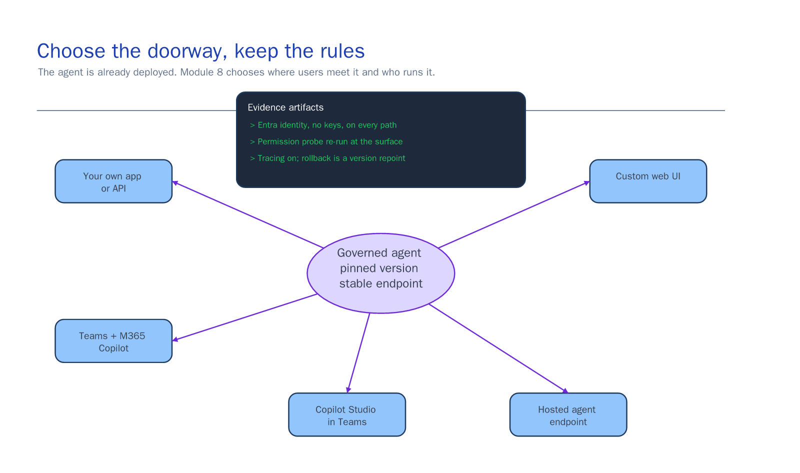

# Module 8 — Deploy and surface it to users

Module 7 proved the assistant is good enough. This module answers the question that decides whether
anyone actually uses it: **where do people meet it, and who runs it once they do?**

That is a smaller question than it looks. The agent is already deployed — it has lived behind a
stable endpoint since module 6. You are not building a system here. You are choosing a doorway, and
writing down who owns what happens behind it.



## What you build

1. A chosen surface, with users able to ask a real question through it.
2. A pinned agent version and a rollback that takes minutes, not a redeploy.
3. The module 2 permission probe re-run against the surface itself.
4. [`accelerator/sample-data/surface-manifest.json`](../accelerator/sample-data/surface-manifest.json) —
   the release contract, graded by the checkpoint.
5. A named triage owner, a pilot exit criterion, and a signed release decision.

## Choose your path

| Option | Where users meet it | Effort | When it wins |
| --- | --- | --- | --- |
| **A. Call the agent from your own app or API** *(default)* | Whatever front end you already have | Lowest — the agent is already deployed | Pilots with one consumer, or an existing app to extend |
| B. Publish the Foundry agent to Teams and Microsoft 365 Copilot | Teams and the M365 Copilot app | Low | Users already work there and you want zero new app adoption |
| C. Copilot Studio agent published to the same channel | Teams and the M365 Copilot app | Low | Module 2 chose the SharePoint/M365 path, so there is no Azure retrieval layer to front |
| D. Foundry hosted agent | A dedicated authenticated endpoint | Medium | Per-agent identity, container control, or an endpoint other teams consume |
| E. Custom web UI | A purpose-built app | Medium–high | Stakeholder demo, custom auth flow, or a required response contract |

**Default: option A.** Standing up a surface for a pilot with one consumer is work that teaches you
nothing about whether the pilot is valuable. If a Python script and a stakeholder in a room answer
the question "is this useful?", start there.

**Choose B when the answer is "they live in Teams".** This is the option most teams do not know
exists — Foundry publishes your existing agent to Teams and Microsoft 365 Copilot directly, builds
the Teams app package, and keeps serving traffic through the same stable endpoint. You do not rebuild
the assistant, and modules 3 through 6 are not thrown away.

**Choose C only if module 2 chose Copilot Studio.** If your source decision was SharePoint and M365
rather than an Azure retrieval layer, the agent already lives in Copilot Studio and publishes to the
same Teams and Microsoft 365 Copilot channel. Do not build a Copilot Studio agent on top of an Azure
retrieval stack you already built — that is two grounding layers arguing with each other.

**A declarative agent in Microsoft 365 Copilot is a different product decision, not a fifth doorway.**
It grounds directly on SharePoint and Graph content, which means it re-does module 3 with different
rules and discards your index, your chunking, and your citation metadata. It is a good answer to
"we never needed an Azure retrieval layer". It is a bad answer to "we built one and now want it in
Teams" — that is option B.

**API Management is a wrapper, not a surface.** Front option A or D with it when your organization
standardizes AI endpoints behind one gateway. It changes who enforces throttling and policy; it does
not change where users meet the agent.

**Migration cost is deliberately low.** A → B is a publish action, not a rewrite. A → D repackages
the same agent behind a dedicated endpoint. In every case the agent, its grounding, and its
evaluation gate are unchanged, and the checkpoint below grades the same manifest. The surface is a
late, reversible decision — which is exactly why it belongs at module 8 and not module 1.

## Implementation

Whichever doorway you choose, five rules do not move:

- **No keys.** Entra identity or managed identity, both in the surface and behind it.
- **The permission boundary from module 2 still applies.** A surface is a new place for it to leak.
- **Tracing carries into the runtime.** The env flags must be set there too, before the SDK loads.
- **Pin the agent version.** Not just the name.
- **Rollback is a repoint, not a redeploy.**

> Foundry and Microsoft 365 publishing surfaces move quickly and some capabilities are preview.
> Check current Microsoft Learn guidance before you run any of these steps rather than copying a
> signature from here.

### Option A — Call the agent from your own app or API

The agent already exists and is versioned. Your application calls it:

```python
resp = openai.responses.create(
    input=question,
    extra_body={"agent_reference": {"name": "grounding-assistant", "type": "agent_reference"}},
)
```

Pin the agent version in your application config, not just the name. Otherwise a version created
during a debugging session silently becomes production. Your app authenticates its users; the agent
authenticates your app. Both halves need an answer before this counts as a surface.

### Option B — Publish the Foundry agent to Teams and Microsoft 365 Copilot

Foundry publishes the agent's **stable endpoint**, so users always talk to one consistent agent while
you roll new versions behind it. Publishing compiles a Teams app manifest, submits it to the Microsoft
365 Copilot and Teams catalogs, and enables the activity protocol the channels need.

Two things to decide before you click publish:

| Decision | Options | What it changes |
| --- | --- | --- |
| Active version | A pinned version, or always-latest | Always-latest means your next debugging version reaches users. Pin it for a pilot |
| Who can use it | Just you, or people in your organization | Just you is immediate and shareable by link. Organization-wide requires Microsoft 365 admin approval and appears under **Built by your org** |

For a pilot, **pin the version and publish to "just you", then share the link** with the named pilot
group. It needs no admin approval, and it keeps the audience the size you wrote down in the manifest.

Publishing creates an Azure Bot Service resource, which needs permissions Foundry roles do not grant
— the **Azure Bot Service Contributor** role on the resource group, plus the `Microsoft.BotService`
provider registered on the subscription. Sort that out before the demo, not during it.

Rolling out a new version later is a version-selector change in Foundry. The endpoint URL does not
change and you do not republish. That is also your rollback.

One flag worth raising with the customer explicitly: publishing means agent responses and metadata
are processed and stored by Microsoft 365 and Teams, under those services' terms and data residency
commitments. If the corpus was sensitive enough to need module 2's permission work, this belongs in
the same review.

Full steps: [Publish agents to Microsoft 365 Copilot and Microsoft Teams](https://learn.microsoft.com/azure/foundry/agents/how-to/publish-copilot).
If the project disables public network access, portal publishing is unavailable and you use the REST
flow instead.

### Option C — Copilot Studio agent in Teams

Only relevant if module 2 landed on Copilot Studio and SharePoint. Publish the agent once, then
connect it to the **Teams and Microsoft 365 Copilot** channel; leaving the Microsoft 365 option
selected makes it available in both, and clearing it limits it to Teams. Turn on end-user
authentication so people outside the organization cannot reach it. Organization-wide distribution
goes through Microsoft 365 admin approval, same as option B.

### Option D — Foundry hosted agent

Package the agent as a container with its own Entra identity and a dedicated endpoint. Take this
route when another team needs to call the agent as a service, or when you need control over the
runtime. The [Deploy as a Hosted Agent activity](../../../activities/advanced-deploy-hosted-agent/README.md)
covers `agent.yaml`, `azd ai agent`, per-agent managed identity, and the endpoint contract.

Carry the tracing env into the deployment or you lose the observability you built in module 7:

```bash
export AZURE_EXPERIMENTAL_ENABLE_GENAI_TRACING=true
export OTEL_INSTRUMENTATION_GENAI_CAPTURE_MESSAGE_CONTENT=true
```

### Option E — Custom web UI

A purpose-built front end over option A. Worth it for a stakeholder demo where the interface is part
of the story, or when you need a response contract Teams cannot express. The
[Build a UI activity](../../../activities/extra-build-ui/README.md) is the reference. The trap is
authentication: a demo UI that calls the agent with a service identity has quietly deleted module 2's
permission boundary, because every user now looks like the same identity. Pass the signed-in user
through, or say out loud that the demo is not permission-accurate.

### Re-prove the permission boundary here

Run the module 2 probe a third time, against the surface. Not against retrieval, not against the
agent — against the doorway a real user walks through. This is where per-user identity gets lost, and
it is cheap to check and expensive to discover later.

### Write the release contract

Record the decision in
[`accelerator/sample-data/surface-manifest.json`](../accelerator/sample-data/surface-manifest.json).
The checkpoint grades it, and it is deliberately the same shape for all five options.

Before you call it a pilot, have answers to these, because someone will ask:

| Question | Where the answer comes from |
| --- | --- |
| Who is in the pilot, and how is access granted and revoked? | Module 2, plus the publish scope you chose here |
| What is the worst-case content staleness? | Module 3 |
| What does it cost per 1,000 questions? | Module 4 numbers × expected volume |
| What is the rollback if quality regresses? | The previous agent version, pinned |
| How does a user report a wrong answer, and who triages it? | This module — name a person |
| What ends the pilot? | The exit criterion below |

That last one deserves a real answer. A pilot without an exit criterion becomes permanent
unsupported infrastructure that nobody admits to owning.

## Verify

```bash
# Contract only
python3 scenarios/ai-grounding/accelerator/scripts/verify_surface.py --offline

# Live: confirm the surface refuses an unauthenticated caller
python3 scenarios/ai-grounding/accelerator/scripts/verify_surface.py \
  --endpoint https://<your-endpoint>
```

Expected:

```
✅ Module 8 checkpoint PASS — the surface has an owner, a boundary, and a way back
```

The offline check asserts a declared surface, keyless Entra or managed-identity auth with no
anonymous access, a pinned agent version, the permission boundary re-proven at the surface, tracing
on in the deployed runtime, a rollback mechanism with a retained previous version, a named triage
owner, a pilot exit criterion, and a signed release decision. It rejects `TBD` and placeholder text,
because a manifest full of `TBD` passes a schema check and tells a risk owner nothing. The live probe
expects `401` or `403`.

Then the full gate:

```bash
python3 scenarios/ai-grounding/accelerator/validate.py --all
```

The evidence pack that leaves with the customer:

1. Evaluation results with per-metric means and the gate threshold *(module 7)*.
2. Red-team findings per category, with mitigation and re-test *(module 7)*.
3. One traced request, end to end *(module 7)*.
4. The permission probe result against the deployed surface *(this module)*.
5. Eight decision records, one per module.
6. A signed release decision: ship, ship-with-conditions, or stop.

"Stop" is a valid, valuable result. A pilot that proves the corpus is too inconsistent to ground on
has saved the customer a year — as long as it says so in writing.

## Troubleshooting

| Symptom | Cause | Fix |
| --- | --- | --- |
| Answers changed after go-live | Version selector left on always-latest | Pin the version; log it in every evaluation run |
| Publishing fails with `403` on `Microsoft.BotService/botServices/write` | Foundry roles do not grant bot permissions | Assign **Azure Bot Service Contributor** on the resource group, then reopen the publish flow |
| Publish dialog says the agent uses an older format | Agent predates the current agent model | Migrate the agent to the new format, then publish |
| Agent published but nobody else can find it | Published to "just you" | Share the link, or republish to the organization and get admin approval |
| Every user sees the same results regardless of permissions | The surface calls the agent with one service identity | Pass the signed-in user through; re-run the module 2 probe |
| No traces after go-live | Tracing env not carried into the deployed runtime | Set both GenAI env vars in the deployment, before the SDK loads |
| Rollback means a full redeploy | Previous version not retained | Keep the previous agent version; make rollback a version repoint |
| Live probe returns `200` unauthenticated | The surface is open | Require Entra auth on ingress before anyone else sees the URL |
| Secrets appear in the deployment config | Key-based auth crept back in | Return to managed identity; scan config for `*_KEY` and connection strings |

## Decision record

The surface you chose and why, in one sentence a non-engineer understands; who can use it and how
that is granted and revoked; the pinned agent version and the rollback mechanism; where traces land;
the named triage owner and review cadence; the pilot exit criterion with a review date; and the
signed release decision with the risk owner's name.

## Next module

There isn't one. You have a grounded, permission-aware, evaluated, traced pilot that real users can
reach, and eight decision records that explain every choice to whoever inherits it.

Extend the build with the [action tools](../../../activities/advanced-action-tools/README.md),
[hosted deployment](../../../activities/advanced-deploy-hosted-agent/README.md), or
[Fabric IQ](../../../activities/extra-fabric-iq/README.md) activities, or start
[module 1](01-provision-foundation.md) again with the customer's own corpus.
