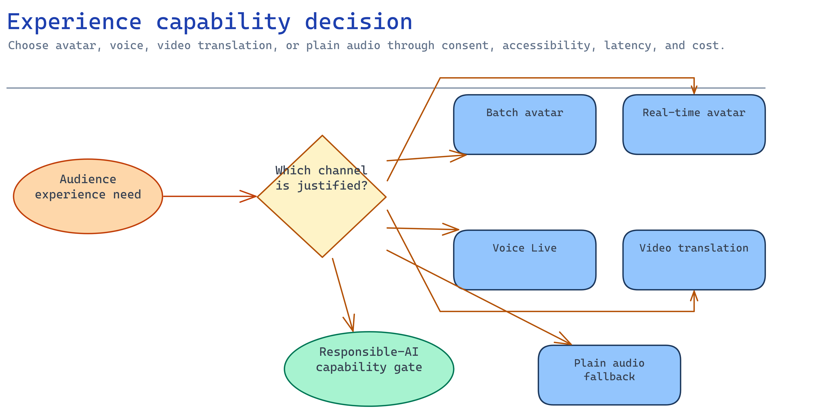

# Module 1 — Select the avatar/experience capability

This is the highest-stakes decision in the scenario, so it leads. The capability you pick sets your
API surface, region list, cost model, latency envelope, accessibility obligations, and — the part
teams skip — the **responsible-AI gating** that can add weeks of registration before you can ship.
Choose wrong and modules 2–7 are rework.

Speech features move fast and several are preview or limited-access; re-check current Microsoft
Learn guidance before you commit.



## What you build

A dated, evidence-backed **capability decision record** (`accelerator/sample-data/capability-decision.json`
is the template) that names, for the pilot:

1. The Azure/Microsoft experience capability and its API + api-version.
2. Region, identity model, and pricing basis.
3. Accessibility alternatives (captions, transcript, non-avatar fallback).
4. The disclosure statement and the responsible-AI gating (limited access, consent) you must clear.

Nothing gets provisioned until this record exists and its RAI gating is internally consistent.

## Choose your path

Five real Microsoft capabilities can deliver "an avatar-led / spoken onboarding moment". They are
not interchangeable.

| Option | What it is | Best when | Real-time? | Custom likeness/voice gating | Status |
| --- | --- | --- | --- | --- | --- |
| **A. Speech TTS avatar — batch synthesis** *(default)* | Async REST job renders a talking-avatar **video file** from text/SSML | Pre-produced, reviewable onboarding videos you approve once and replay | No (async job) | Standard avatar+voice = none; custom = limited access | GA (`api-version=2024-08-01`) |
| B. Speech TTS avatar — real-time synthesis | Speech SDK streams avatar video over **WebRTC** live | A live, interactive kiosk/agent that shows a face | Yes | Same as A | GA |
| C. Voice Live API | Fully-managed **speech-to-speech** voice agent; can also emit **avatar visuals** | A conversational onboarding assistant you speak to | Yes | Same as A when avatar is on | See docs (maps to `extra-voice-live`) |
| D. Video translation | Localises an **existing** onboarding video into other languages, preserving the speaker's voice | You already have approved video and need many locales | No (batch) | Voice replication of a real speaker — treat as consent-bearing | GA-ish; verify |
| E. Plain audio (TTS / Voice Live audio-only) | Natural-voice narration, **no face** | Accessibility-first, lowest cost/risk, no likeness | Either | Standard voice = none | GA |

**Default: Option A (batch avatar synthesis).** Onboarding content is authored, reviewed, and
replayed — it is not a live conversation. Batch synthesis gives you a concrete, reviewable video
artifact that flows cleanly through the human-approval gate in module 6, uses a **standard** avatar
and voice (so there is *no* talent likeness to license or limited-access form to file), and is the
cheapest thing to get to a governed pilot. Verified overview:
<https://learn.microsoft.com/azure/ai-services/speech-service/text-to-speech-avatar/what-is-text-to-speech-avatar>

**Migration cost.**
- **A → B** (batch → real-time) is moderate: same avatars/voices, but you swap a REST poll for a
  Speech-SDK WebRTC client and take on TURN/firewall and per-session-latency work.
- **A → C** (batch → Voice Live) is a larger rebuild: you move from "render a video" to "run a
  live speech-to-speech agent", which is the `extra-voice-live` activity's territory.
- **A → E** (drop the avatar) is trivial and always available as your accessibility fallback.
- **Anything → custom avatar or custom/personal voice** is the expensive jump: it triggers
  **limited-access registration** and talent consent (see Implementation → RAI). Budget weeks, not
  hours. Do not promise a customer's CEO's face in a demo.

## Implementation

You are producing one JSON decision record. Each option below tells you exactly what to write into
it and the verified facts behind each field.

### Option A — Speech TTS avatar, batch synthesis (default)

**API (verified).** Batch synthesis is a REST job on the Speech/AIServices resource host:

```
PUT  https://{resource}.cognitiveservices.azure.com/avatar/batchsyntheses/{SynthesisId}?api-version=2024-08-01
GET  https://{resource}.cognitiveservices.azure.com/avatar/batchsyntheses/{SynthesisId}?api-version=2024-08-01
```

You submit text or SSML, poll `status` (`NotStarted → Running → Succeeded/Failed`), then download
`outputs.result` (an `.mp4`). Limits: payload ≤ 500 KB, up to 200 concurrent jobs per resource,
output ≤ 20 minutes. Standard resolution defaults to 1920×1080 at 25 FPS.
<https://learn.microsoft.com/azure/ai-services/speech-service/text-to-speech-avatar/batch-synthesis-avatar>

Record these fields:

```json
{
  "selected_capability": "speech-tts-avatar-batch",
  "api": {
    "name": "Text to speech avatar batch synthesis (REST)",
    "operation": "PUT avatar/batchsyntheses/{SynthesisId}?api-version=2024-08-01",
    "host": "https://{resource}.cognitiveservices.azure.com"
  },
  "identity": "managed-identity-entra-keyless",
  "consent_and_gating": { "uses_custom_avatar": false, "uses_custom_or_personal_voice": false }
}
```

**Identity (verified).** The Speech data plane accepts a Microsoft Entra token **only if the
resource has a custom subdomain** — module 2's Bicep sets `customSubDomainName`, so avatar synthesis
is keyless. Speech is data-plane heavy: assign **Cognitive Services Speech User**
(`f2dc8367-1007-4938-bd23-fe263f013447`); the generic *Cognitive Services Contributor* / *Owner*
roles grant **no** Speech data access.
<https://learn.microsoft.com/azure/ai-services/speech-service/role-based-access-control>

### Option B — Speech TTS avatar, real-time synthesis

Real-time streams the avatar video to the browser over **WebRTC** via the Speech SDK. It needs the
**Standard S0** tier and outbound access to the TURN relay
`relay.communication.microsoft.com` (UDP 3478 / TCP 443, `20.202.0.0/16`); fetch ICE server details
from the Speech REST API. You set `AvatarConfig("lisa", "casual-sitting")` and a voice such as
`en-US-Ava:DragonHDLatestNeural`.
<https://learn.microsoft.com/azure/ai-services/speech-service/text-to-speech-avatar/real-time-synthesis-avatar>

Record `"selected_capability": "speech-tts-avatar-realtime"` and add a network/firewall note (the
TURN egress rule) plus a per-session latency budget. This is the right pick only if onboarding is
genuinely interactive; otherwise Option A is cheaper and reviewable.

### Option C — Voice Live API

Voice Live is a **fully-managed speech-to-speech** interface: one WebSocket streams mic audio in and
returns audio, **avatar visuals**, and action triggers — no manual STT→LLM→TTS stitching. It covers
140+ STT locales and 600+ voices across 150+ locales, and **agent mode authenticates with Microsoft
Entra ID** (not a Speech key).
<https://learn.microsoft.com/azure/ai-services/speech-service/voice-live>

Building this is the [Voice Live activity](../../../activities/extra-voice-live/README.md) — link to
it, don't reinvent it. Record `"selected_capability": "voice-live-realtime-avatar"` (or
`voice-live-audio`) and note that a live agent needs module 4's grounded agent first.

### Option D — Video translation

Video translation localises an **existing** approved video into more languages while replicating the
original speaker's voice. Use it only when you already have signed-off video and a multilingual
cohort. Because it replicates a real person's voice, treat the source as consent-bearing.
<https://learn.microsoft.com/azure/ai-services/speech-service/video-translation-overview>

Record `"selected_capability": "video-translation"` and treat the original speaker's consent as a
gate even though no *custom* model is trained.

### Option E — Plain audio (accessibility-first)

Standard-voice narration with no face. Lowest cost and lowest risk, and it is **also your mandatory
non-avatar fallback** for every other option (module 5). Record `"selected_capability":
"speech-tts-audio-only"`. Choosing E on purpose — because a face adds risk without value here — is a
legitimate, defensible outcome. Say so in the decision record.

### The responsible-AI gate (applies to A–D, verified)

This is the part that turns a two-day build into a two-month program if you miss it.

- **Standard avatar + standard voice: no registration.** Disclosure to users is still required.
- **Custom avatar (video/photo) or custom/personal voice: Limited Access.** Available by
  registration only, to customers managed by Microsoft, via the intake form
  <https://aka.ms/customneural>. A **custom video avatar needs ≥ 10 minutes of the actor's video**
  and their **explicit written consent**; you must share the *Disclosure for voice and avatar talent*
  with them in advance, may only use approved use cases, must **disclose the synthetic nature** to
  end users, and must offer a feedback channel.
  <https://learn.microsoft.com/azure/foundry/responsible-ai/speech-service/text-to-speech/limited-access>
- **Disclosure design** (how and when to tell users it's synthetic):
  <https://learn.microsoft.com/azure/foundry/responsible-ai/speech-service/text-to-speech/concepts-disclosure-guidelines>

The consistency rule you enforce in Verify: if the record says you use a custom avatar or
custom/personal voice, it must also record `limited_access_registration_required`,
`talent_consent_required`, and the form URL. A record that names a custom likeness without that
gating is the failure that surfaces in legal review after the build.

## Verify

You have not provisioned anything yet, so verify the decision record itself and the one external
fact it depends on. Check each against your own record and Microsoft Learn.

**1. The region you named actually offers the capability you chose.** Avatar and Voice Live are
region-gated. Open the Speech regions table and find your region in the column for your capability
(batch avatar, real-time avatar, or Voice Live):

<https://learn.microsoft.com/azure/ai-services/speech-service/regions?tabs=ttsavatar>

Your region must appear with a check in that column. If it does not, avatar pricing will not even
display there and module 2 will fail to provision the feature, so change `region` in the record now.
At the time of writing, batch and real-time avatar are offered in `westus2`, `eastus`, `eastus2`,
`southcentralus`, `southeastasia`, `centralindia`, `westeurope`, `swedencentral`, `northeurope`,
`italynorth`, and `francecentral` (limited capacity). Re-read the table; the list changes.

**2. The responsible-AI gating in your record is internally consistent.** Read your own record and
compare the likeness fields with the gating fields:

```bash
jq '.consent_and_gating |
    {uses_custom_avatar, uses_custom_or_personal_voice,
     limited_access_registration_required, talent_consent_required, limited_access_form}' \
  scenarios/avatar-onboarding/accelerator/sample-data/capability-decision.json
```

If either `uses_custom_avatar` or `uses_custom_or_personal_voice` is `true`, the record must also
show `limited_access_registration_required: true`, `talent_consent_required: true`, and the intake
form `https://aka.ms/customneural`. A record that names a custom avatar or custom/personal voice but
omits the limited-access path is the failure that surfaces in legal review after the build. Standard
prebuilt avatar and voice need no registration.
<https://learn.microsoft.com/azure/foundry/responsible-ai/speech-service/text-to-speech/limited-access>

**3. A disclosure statement is present even for a standard avatar.** Users must be told the presenter
is synthetic whether or not a custom likeness is used:

```bash
jq -e '.disclosure_statement | length > 0' \
  scenarios/avatar-onboarding/accelerator/sample-data/capability-decision.json
```

`true` is the result you want. An empty or missing disclosure means an undisclosed synthetic persona
could reach real employees, which the disclosure guidance forbids:
<https://learn.microsoft.com/azure/foundry/responsible-ai/speech-service/text-to-speech/concepts-disclosure-guidelines>

## Decision record

Keep the JSON record with the pilot. One paragraph of prose alongside it: the chosen capability and
the two runners-up with why each lost; the region and the availability evidence (URL + date); the
identity model; the disclosure statement; and — if custom likeness/voice — the limited-access
registration status and talent-consent status. Standard-avatar default means the exit story is
simple: nothing of a real person is retained.

## Next module

[Module 2 — Provision the Foundry + Speech foundation](02-foundation.md) deploys the keyless
resources this decision implies.
