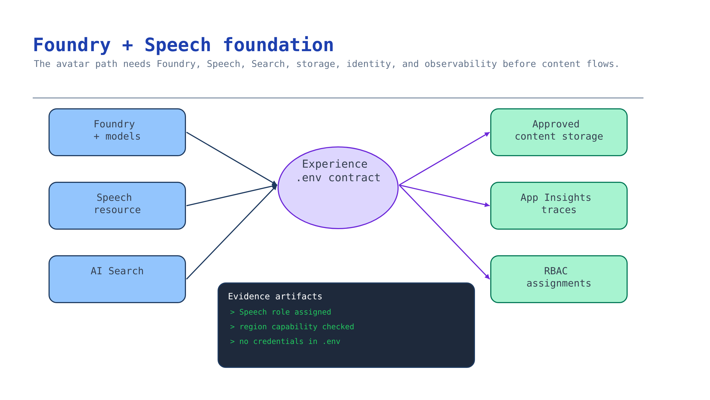

# Module 2 — Provision the Foundry + Speech foundation

Module 1 decided *what* you're building. This module provisions the keyless footprint every later
module writes into: Foundry + models, Azure AI Search, the Speech data plane (same AIServices
account), storage for approved content and rendered output, and observability. Get the identity
model right now and modules 3–7 are configuration.

This module follows the kit's working `infra/resources.bicep` and current Microsoft Learn guidance.



## What you build

| Resource | Why this scenario needs it |
| --- | --- |
| Foundry account (`AIServices`) + project | Hosts models, the grounded agent, connections — **and fronts Azure AI Speech** (avatar/Voice Live) with a custom subdomain for keyless Entra auth |
| Chat deployment | Grounded drafting and help (module 4) |
| Embedding deployment | Vectorises approved onboarding content for the knowledge base (modules 3–4) |
| Azure AI Search (semantic ranking on) | The grounded assistant's knowledge base backend |
| Storage: `approved-content` + `experience-output` | Governed source corpus (module 3) and rendered avatar video/transcript (module 5) |
| Log Analytics + Application Insights | Traces and evaluation correlation (module 7) |
| Role assignments | Keyless access between search, project, models, storage, **and the Speech data plane** |

Output: an `.env` contract with **no secrets**, consumed by every later module. This maps to
**Foundations Steps 1–2** — [Foundations activity](../../../activities/foundations/README.md).

## Choose your path

| Option | Reproducible | Provisions Speech + custom subdomain | Best when | Cost while idle |
| --- | --- | --- | --- | --- |
| **A. Scenario Bicep** *(default)* | Yes, reviewable IaC | Yes (AIServices account) | Building this scenario for a customer | Search basic + Log Analytics + idle model deployments |
| B. `azd up` (kit root infra) | Yes | Yes (AIServices), but no `experience-output` container/embedding | Running the whole starter kit | Same, plus ACR |
| C. Foundry portal + Speech resource | No | Manual | A throwaway demo | Lowest; free Search tier possible |
| D. Bring your own landing zone | Customer's IaC | Verify it | Customer already has governed Foundry + Speech | Already owned |

**Default: Option A.** It is the only path that provisions *both* the embedding deployment and both
storage containers this scenario needs, sets the Speech custom subdomain, and wires the Speech
data-plane role — and it produces a diff a platform team can review.

**Migration cost.** A → D is cheap: modules 3+ only read the `.env` contract, so pointing at customer
resources is a variable change. C → A is expensive: portal resources have generated names and no
template. Do not demo from C then promise A.

### Region and capability availability come first

Avatar and Voice Live are **region-gated**, and your models must be deployable in the same region.
Check both **before** deploying:

```bash
# Confirm your chosen chat/embedding models are available in the target region:
az cognitiveservices account list-skus --location westus2 --kind AIServices -o table
```

- Avatar/Voice Live region support:
  <https://learn.microsoft.com/azure/ai-services/speech-service/regions?tabs=ttsavatar>
- Real-time avatar requires the **Standard S0** Speech tier.

> **Speech is keyless only with a custom subdomain.** Module 2's Bicep sets
> `customSubDomainName` on the AIServices account, which is exactly what makes the avatar batch API
> accept an Entra token. Verified:
> <https://learn.microsoft.com/azure/ai-services/speech-service/role-based-access-control>

## Implementation

### Option A — Scenario Bicep (default)

The template is [`accelerator/main.bicep`](../accelerator/main.bicep); defaults live in
[`accelerator/parameters.example.json`](../accelerator/parameters.example.json).

```bash
az login
az account set --subscription "<subscription-id>"

# Compile before you deploy — catches schema errors without touching Azure.
bicep build scenarios/avatar-onboarding/accelerator/main.bicep --stdout > /dev/null

./scenarios/avatar-onboarding/accelerator/scripts/deploy.sh rg-avatar-onboarding westus2
```

`deploy.sh` creates the resource group, runs `az deployment group validate` first, deploys, then
writes `accelerator/.env` from the template outputs. It passes your signed-in object ID as
`principalId` so you get keyless data-plane access — including the **Speech** data plane — without
anyone issuing a key.

What the template does that matters, and why:

```bicep
// Keyless-first on storage: shared key access is OFF, so ingestion uses Entra ID.
allowSharedKeyAccess: false

// Speech (avatar/Voice Live) accepts Entra tokens ONLY with a custom subdomain.
customSubDomainName: 'aif-${resourceToken}'

// Speech is data-plane heavy — assign the Speech-named role, not a generic contributor.
resource userSpeechRole 'Microsoft.Authorization/roleAssignments@2022-04-01' = if (!empty(principalId)) {
  scope: foundry
  properties: {
    principalId: principalId
    roleDefinitionId: roleCognitiveServicesSpeechUser  // f2dc8367-1007-4938-bd23-fe263f013447
    principalType: 'User'
  }
}
```

To deploy into an existing resource group without the script:

```bash
az deployment group create \
  --resource-group <existing-rg> \
  --template-file scenarios/avatar-onboarding/accelerator/main.bicep \
  --parameters @scenarios/avatar-onboarding/accelerator/parameters.example.json \
  --parameters principalId="$(az ad signed-in-user show --query id -o tsv)"
```

### Option B — `azd up` (kit root infra)

Use when you want the shared kit footprint.

```bash
azd auth login
azd up          # provisions infra/main.bicep + infra/resources.bicep
azd env get-values > scenarios/avatar-onboarding/accelerator/.env
```

The root infra provisions Foundry + project + **chat** deployment + AI Search + observability. It
does **not** create the embedding deployment or the `experience-output` container. Add them:

```bash
RG=$(azd env get-value AZURE_RESOURCE_GROUP)
ACCOUNT=$(azd env get-value AZURE_AI_FOUNDRY_NAME)

az cognitiveservices account deployment create \
  --resource-group "$RG" --name "$ACCOUNT" \
  --deployment-name embedding \
  --model-name text-embedding-3-large --model-version 1 --model-format OpenAI \
  --sku-name Standard --sku-capacity 30

STORAGE=$(azd env get-value AZURE_STORAGE_ACCOUNT_NAME)
az storage container create --account-name "$STORAGE" --name experience-output --auth-mode login
```

Then append `AZURE_AI_EMBEDDING_DEPLOYMENT_NAME`, `AZURE_SPEECH_ENDPOINT`, `AZURE_SPEECH_REGION`,
and `AZURE_EXPERIENCE_OUTPUT_CONTAINER_NAME` to the `.env`. Confirm the account has a custom
subdomain (it does when created by the kit infra).

### Option C — Foundry portal + Speech

For a same-day demo. Create a project (a Foundry account is created for you), deploy a chat and an
embedding model, and connect a Search service. For avatar, open **Build → Models → Azure Speech —
Text to Speech Avatar** and try it in the playground; the **Code** tab gives you the request. Record
endpoints and names into `accelerator/.env` by hand. Accept the trade: generated names, no template,
nothing to review, and the free Search tier can't use managed identity for model access.
<https://learn.microsoft.com/azure/ai-services/speech-service/text-to-speech-avatar/batch-synthesis-avatar>

### Option D — Bring your own landing zone

No new resources. Verify what exists and fill the same contract.

```bash
az cognitiveservices account list --query "[?kind=='AIServices'].{name:name,rg:resourceGroup,loc:location,subdomain:properties.customSubDomainName}" -o table
az search service list --query "[].{name:name,rg:resourceGroup,sku:sku.name,semantic:properties.semanticSearch}" -o table
```

Confirm the five things this scenario depends on:

1. Foundry account has `allowProjectManagement: true`.
2. The account has a **custom subdomain** (required for keyless Speech).
3. The region supports your chosen avatar/Voice Live capability.
4. Search is **Basic or higher** with semantic ranking.
5. Your identity holds **Cognitive Services Speech User** on the account, plus **Search Service
   Contributor** + **Search Index Data Contributor** on Search.

```bash
# Assign the Speech data-plane role if missing:
az role assignment create --assignee "$(az ad signed-in-user show --query id -o tsv)" \
  --role "Cognitive Services Speech User" \
  --scope $(az cognitiveservices account show -g <rg> -n <account> --query id -o tsv)
```

## Verify

```bash
python3 scenarios/avatar-onboarding/accelerator/scripts/verify_foundation.py
```

Expected:

```
✅ Module 2 checkpoint PASS — Foundry + Speech foundation is provisioned and keyless
```

The checkpoint asserts the `.env` contract is complete and secret-free, that Search answers with
Entra ID, that both deployments exist, and that the **Speech avatar data plane answers with an Entra
token** (the keyless proof). Run with `--offline` to check structure only.

## Troubleshooting

| Symptom | Cause | Fix |
| --- | --- | --- |
| `401`/`403` from Search | Missing data-plane roles; RBAC propagation lag | Assign Search Service Contributor + Search Index Data Contributor, wait ~5 min |
| `401` from `avatar/batchsyntheses` with a token | No custom subdomain on the account | Redeploy Option A (sets it), or add `customSubDomainName` |
| `403` from Speech though you're Owner | Generic Owner/Contributor grants no Speech data access | Assign **Cognitive Services Speech User** (`f2dc8367-…`) |
| Model deployment fails | Model/capacity unavailable in region | `az cognitiveservices account list-skus …`, change region or lower capacity |
| Avatar features missing in region | Region not on the avatar list | Redeploy in a region from the `?tabs=ttsavatar` table |
| `StorageAccountAlreadyTaken` | `resourceToken` collides globally | Pass a different `resourceToken` (5–12 lowercase chars) |
| `.env` written but empty | Deployment produced no outputs | Check `accelerator/.deployment-outputs.json`; re-run |

## Decision record

Record and keep: chosen option and why; region and the avatar/Voice Live availability evidence
(URL + date); chat + embedding model and version; Search tier; that the account has a custom
subdomain (so Speech is keyless); the Speech role assigned; and who owns the resource group. One
short paragraph and the `.env` variable **names** — not values.

## Next module

[Module 3 — Build the governed content pipeline](03-content-pipeline.md) turns approved HR/onboarding
sources into the typed, traceable claim set that gates everything downstream.
