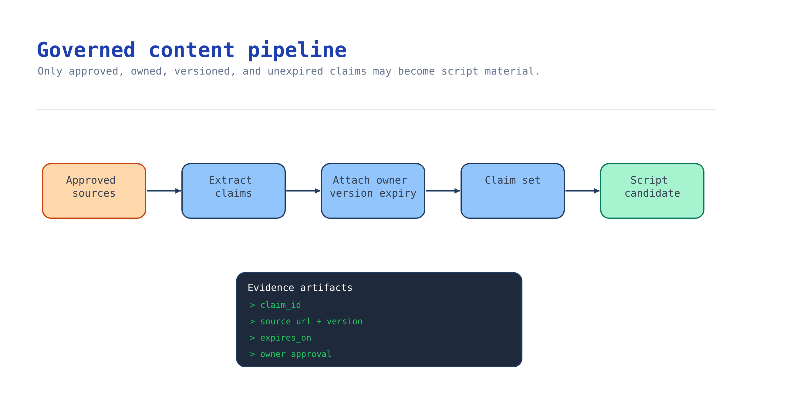

# Module 3 — Build the governed content pipeline

An onboarding avatar that says something wrong is worse than no avatar: it's a confident,
face-attached, replayable error. This module builds the pipeline that guarantees **only approved
HR/onboarding content reaches the experience**, as a typed, versioned, owned, traceable claim set.

Retrieval quality can be improved later; a wrong or expired claim published on a synthetic face is
the failure that ends the pilot.



## What you build

1. A **claim set**: every fact the experience may state, as an atomic claim with a stable id, the
   exact approved wording, an authoritative source reference, a named owner, required reviewers, and
   a help path. The template is [`accelerator/sample-data/claims.json`](../accelerator/sample-data/claims.json).
2. A **governed store**: the approved source documents in the keyless `approved-content` container,
   with owner/version/expiry metadata preserved.
3. A **gate**: nothing downstream may cite content that is not in the claim set. The renderer in
   module 5 enforces this — a script segment whose spoken text is not an exact approved claim is
   rejected.

## Choose your path

Where should the approved corpus live and how is it governed on the way in?

| Option | Where approved content lives | Governance carried forward | Build effort | Best when |
| --- | --- | --- | --- | --- |
| **A. Blob `approved-content` + typed claim set** *(default)* | Azure Storage container from module 2 | Owner/version/expiry in claim metadata; Entra-only access | Low | You control onboarding docs and want a reviewable, exportable corpus |
| B. Foundry IQ / Azure AI Search knowledge base | Search index over blob/SharePoint/etc. | ACL sync + query-time enforcement under the caller's identity | Medium | Content spans systems and needs permission-aware retrieval (see the AI Grounding scenario) |
| C. SharePoint / M365 (Copilot-style) | Existing SharePoint libraries | Inherited M365 permissions | Lowest config | The authoritative content already lives in SharePoint and won't move |
| D. Customer system of record via export | Their HRIS/LMS export | Whatever the export preserves | Medium | Content is owned by an HR system and must stay authoritative there |

**Default: Option A.** A small, explicit, typed claim set backed by a keyless blob container is the
right primitive for onboarding: the number of facts is small, they need named owners and expiry
dates, and every one must be individually approvable in module 6. You get a corpus a customer can
review, diff, and export — and the claim set is the contract the grounded assistant (module 4) and
the renderer (module 5) both read.

**Choose B** when onboarding content is genuinely spread across systems and you need permission-aware
retrieval; the module-4 knowledge base becomes your source of truth and this claim set becomes the
*approved subset* the experience may speak. **Choose C** when the answer is "this is a Copilot, not
an app". **Choose D** when HR insists their system stays authoritative — you export a versioned
snapshot and never let the avatar outrun it.

**Migration cost.** A → B is cheap: the claim set survives; you add a knowledge base behind it. B → A
is cheap too (wrap the index). C → A/B is a rebuild. This asymmetry is why A is the default.

### Four questions to answer before writing claims

1. **Who owns each fact** — the named person who can approve wording and is accountable for it.
2. **What is the authoritative source** — the document + version the wording is drawn from.
3. **When does it expire** — a `review_by` date after which the claim must not be published.
4. **What happens when the source changes** — the claim is invalidated and the experience is paused
   (module 6's withdrawal path), not silently re-rendered.

## Implementation

### Option A — Blob + typed claim set (default)

**Model each claim.** The claim is the atom of approval. Exact wording lives here so the avatar can
never paraphrase a policy:

```json
{
  "claim_id": "ONB-001",
  "approved_wording": "Complete your benefits selection in the employee portal during your first week.",
  "source_reference": "benefits-guide@demo-v1#enrolment",
  "owner": "demo-benefits-owner@example.invalid",
  "required_reviewers": ["SME"],
  "help_path": "Demo Benefits Support Desk",
  "locale": "en"
}
```

The pack carries `version`, `content_owner`, and `review_by` (expiry). Use synthetic/fictional data
only — never real employee data or a real person's likeness. The sample pack is fully synthetic and
is the shape to copy.

**Upload the approved sources keylessly.** Shared-key access is disabled on the storage account, so
you ingest with Entra ID:

```bash
STORAGE=$(grep AZURE_STORAGE_ACCOUNT_NAME scenarios/avatar-onboarding/accelerator/.env | cut -d= -f2)
az storage blob upload-batch \
  --account-name "$STORAGE" --auth-mode login \
  --destination approved-content \
  --source scenarios/avatar-onboarding/accelerator/sample-data
```

**Keep owner/version/expiry queryable.** Store them as blob metadata or index tags so an audit can
answer "who approved this and when does it expire" without opening files:

```bash
az storage blob metadata update --account-name "$STORAGE" --auth-mode login \
  --container-name approved-content --name claims.json \
  --metadata owner=demo-onboarding-content-owner version=0.1.0 review_by=2026-10-01
```

### Option B — Foundry IQ / Azure AI Search knowledge base

When content spans systems, build a permission-aware knowledge base and treat this claim set as the
approved subset the avatar may speak. The full pattern — knowledge sources, ACL carry-forward at
ingestion, and query-time enforcement under the caller's Entra identity — is the AI Grounding
scenario's Module 2/3 work; do not duplicate it here. The onboarding-specific rule stands: the
avatar speaks only claims in **this** set, even if the knowledge base can retrieve more.

Verified knowledge-source and permission facts:
<https://learn.microsoft.com/azure/search/agentic-knowledge-source-overview> ·
<https://learn.microsoft.com/azure/search/search-query-access-control-rbac-enforcement>

### Option C — SharePoint / M365

Configuration, not code: connect the approved SharePoint library, scope to the onboarding site, and
let M365 permissions govern access. Still produce the claim set — it is what the approval gate signs
off. Confirm the site's permissions reflect intent (inherited permissions on a "public" site are the
usual surprise) and test with a low-privilege account.

### Option D — Export from a system of record

Export a **versioned snapshot** (with the source system's version stamped into
`source_reference`), load it as the claim set, and set `review_by` to the export's validity window.
Never let the avatar speak content newer or older than the snapshot you approved.

## Verify

Prove the governed corpus is reachable without keys and that the claim set is actually approvable.
Check each against your own storage account and claim file.

**1. The approved content is in blob storage and reachable with your Entra identity, not a key.**

```bash
set -a; source scenarios/avatar-onboarding/accelerator/.env; set +a
az storage blob list \
  --account-name "$AZURE_STORAGE_ACCOUNT_NAME" \
  --container-name "$AZURE_STORAGE_CONTAINER_NAME" \
  --auth-mode login --query "[].name" -o tsv
```

You should see the files you uploaded (for example `claims.json`). Shared-key access is off on this
account, so a `403` here means you lack **Storage Blob Data Reader** or **Contributor**; grant the
role and re-run. Do not re-enable shared keys.

**2. Owner, version, and expiry are queryable without opening the file.** An audit must answer "who
approved this and when does it expire" from metadata alone:

```bash
az storage blob metadata show \
  --account-name "$AZURE_STORAGE_ACCOUNT_NAME" \
  --container-name "$AZURE_STORAGE_CONTAINER_NAME" \
  --name claims.json --auth-mode login -o json
```

You want `owner`, `version`, and `review_by` present. If they are empty, set them (module 3
Implementation): a corpus with no owner or expiry cannot be governed or withdrawn.

**3. Every claim is approvable, and nothing is already expired.** Read your own claim set and check
the fields that module 6 signs and module 5 enforces:

```bash
jq -e '(.version != null) and (.review_by != null) and
       (all(.claims[]; .claim_id and .approved_wording and .source_reference and .owner
                       and (.required_reviewers | length > 0)))' \
  scenarios/avatar-onboarding/accelerator/sample-data/claims.json

jq -r --arg today "$(date -u +%F)" \
  '.review_by as $d | if $d < $today then "EXPIRED: \($d)" else "in date: \($d)" end' \
  scenarios/avatar-onboarding/accelerator/sample-data/claims.json
```

The first command must print `true`: a claim missing an owner or a source cannot be approved in
module 6, and a pack with no `review_by` never expires. The second must not print `EXPIRED`. An
expired claim spoken on a synthetic face as current policy is exactly the failure this pipeline
exists to prevent.

## Troubleshooting

| Symptom | Cause | Fix |
| --- | --- | --- |
| `403` on blob upload | Shared-key access is off (by design) and you're not using `--auth-mode login` | Sign in with `az login`; ensure Storage Blob Data Contributor; add `--auth-mode login` |
| Claim rejected: missing owner | An unowned fact | Assign a named owner; unowned claims can't be approved |
| Duplicate claim id | Copy-paste | Ids must be unique; the check fails on duplicates |
| Expired content still publishable | `review_by` in the past ignored | Treat `review_by` as a hard gate; invalidate and re-approve |
| Avatar paraphrases policy | Free-text drafting instead of exact claims | The renderer requires spoken text to equal an approved claim; author claims, not prose |
| Source changed, experience stale | No invalidation path | Wire the module-6 withdrawal path: source change → claim invalid → pause |

## Decision record

Keep: chosen source option and the runners-up with why each lost; the claim-set version and its
`review_by`; where the approved corpus lives and how access is governed (Entra-only, no keys); the
owner of each claim; and the invalidation rule ("source change ⇒ claim invalid ⇒ experience paused").
One page, kept with the pilot.

## Next module

[Module 4 — Build the grounded assistant behind the experience](04-grounded-assistant.md) turns this
claim set into a cited, refusing assistant that drafts and answers only from approved content.
