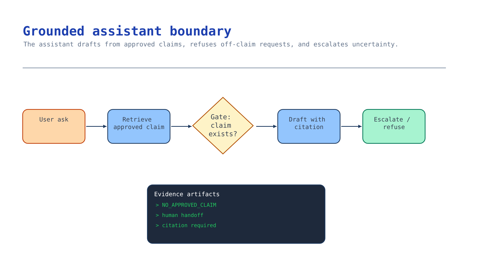

# Module 4 — Build the grounded assistant behind the experience

The avatar is a mouth. This module builds the brain: a grounded assistant that drafts onboarding
script text **only** from the approved claim set, **cites** every claim, **refuses** anything it
can't ground, and **hands off** to a human help path. If the assistant can invent a benefit, the
avatar will say it with a smile.

This module is the [Foundations activity](../../../activities/foundations/README.md) **Steps 3–4**
applied to onboarding — build it there for the mechanics, and apply the onboarding-specific rules
below. Prompt Flow is not part of this curriculum; use agents + tools + retrieval.



## What you build

1. A grounded generation path (model-with-retrieval **or** a Foundry agent) that produces script
   text traceable to approved claims.
2. Guardrails: citation on every claim, **abstention** when no approved claim covers the question,
   and **escalation** to the claim's `help_path`.
3. A retrieval boundary so the assistant sees only approved content (module 3's corpus / knowledge
   base).

## Choose your path

| Option | What it is | Grounding | Build effort | Best when |
| --- | --- | --- | --- | --- |
| **A. Model + retrieval (grounded prompt)** *(default)* | Chat deployment + your retrieval over the claim set, with a strict system prompt | You control the prompt and the citations | Low | The claim set is small and you want maximum control over refusal/citation |
| B. Foundry agent + knowledge base | A named, versioned Foundry agent with a knowledge tool | Managed retrieval + citations from the knowledge base | Medium | You want a reusable, governed agent that other channels share |
| C. Foundry agent + agentic retrieval (Foundry IQ) | Agent over a permission-aware knowledge base | Query planning + answer synthesis + ACL enforcement | Medium/High | Content spans systems and needs permission-aware retrieval |

**Default: Option A** for the pilot: a chat deployment with retrieval over the small approved claim
set and a system prompt that forbids ungrounded statements. It is the least machinery for the
tightest control over the two behaviours that matter here — **cite** and **refuse**. Graduate to
**B** when you want a named, versioned agent shared across channels (and it's the natural bridge to
module 5 Option C, Voice Live), and to **C** when retrieval must be permission-aware across systems.

**Migration cost.** A → B/C keeps the claim set, the golden questions (module 7), and the refusal
contract; you swap the drafting call for an agent invocation. B → A is trivial. The evaluation set
you build in module 7 survives all three — build it once.

## Implementation

### Option A — Model + retrieval (default)

**Ground on the claim set and forbid invention.** The system prompt is the guardrail; keep it
explicit:

```python
SYSTEM_PROMPT = """You draft onboarding script text for a synthetic avatar presenter.
Rules:
1. State only facts present in the provided APPROVED CLAIMS. Never paraphrase policy.
2. For each sentence, cite the claim_id you used.
3. If no approved claim covers the request, reply exactly: "NO_APPROVED_CLAIM" and name the help_path.
4. Never invent benefits, dates, amounts, or obligations.
"""
```

**Draft against approved claims only** (keyless, `DefaultAzureCredential`):

```python
import json, os
from pathlib import Path
from azure.identity import DefaultAzureCredential, get_bearer_token_provider
from openai import AzureOpenAI

claims = json.loads(Path("scenarios/avatar-onboarding/accelerator/sample-data/claims.json").read_text())
approved = "\n".join(f'{c["claim_id"]}: {c["approved_wording"]} (help: {c["help_path"]})'
                     for c in claims["claims"])

token_provider = get_bearer_token_provider(
    DefaultAzureCredential(), "https://cognitiveservices.azure.com/.default")
client = AzureOpenAI(
    azure_endpoint=os.environ["AZURE_AI_FOUNDRY_ENDPOINT"],
    azure_ad_token_provider=token_provider,
    api_version="2024-10-21",
)

def draft(question: str) -> str:
    resp = client.chat.completions.create(
        model=os.environ["AZURE_AI_MODEL_DEPLOYMENT_NAME"],
        messages=[
            {"role": "system", "content": SYSTEM_PROMPT},
            {"role": "user", "content": f"APPROVED CLAIMS:\n{approved}\n\nDraft: {question}"},
        ],
        temperature=0,
    )
    return resp.choices[0].message.content
```

> Search before you implement: confirm the current `AzureOpenAI` / Foundry chat signature and
> `api_version` against Microsoft Learn — the SDK surface moves. The onboarding rule is fixed:
> **draft only from `claims.json`, cite `claim_id`, refuse with `NO_APPROVED_CLAIM`.**

**Enforce refusal downstream.** Module 5's renderer already rejects any script segment whose spoken
text is not an *exact* approved claim, so a paraphrase or an invented sentence cannot be rendered —
the model is the first gate, the renderer is the backstop.

### Option B — Foundry agent + knowledge base

Build the agent in [Foundations Step 4](../../../activities/foundations/README.md): a named,
versioned agent with a knowledge tool over module 3's corpus, a persona ("onboarding script
drafter"), and the same refusal instruction. Store the agent name in `.env`
(`AZURE_FOUNDRY_AGENT_NAME`) so module 5 Option C (Voice Live agent mode) and module 7 (evaluation)
reuse it. The agent returns citations from the knowledge base; assert they map to approved claim ids.

### Option C — Foundry agent + agentic retrieval (Foundry IQ)

When retrieval must be permission-aware, put the agent over a Foundry IQ knowledge base. Use the
preview API version for query planning and answer synthesis, pass the end-user token in
`x-ms-query-source-authorization`, and keep the "approved claims only" instruction. Verified facts
(from the AI Grounding stack):
<https://learn.microsoft.com/azure/search/agentic-retrieval-how-to-create-knowledge-base>

Whichever option: the assistant may draft *candidate* script text, but a **human still approves** the
final wording in module 6. The assistant speeds authoring; it does not grant publication.

## Verify

Ground-truth the two behaviours that matter with a tiny golden set (this seeds module 7):

```bash
python3 - <<'PY'
# Offline contract check: refusal must fire for an off-claim question.
import json
from pathlib import Path
claims = json.loads(Path("scenarios/avatar-onboarding/accelerator/sample-data/claims.json").read_text())
ids = {c["claim_id"] for c in claims["claims"]}
# Simulate: an on-claim ask maps to an id; an off-claim ask must return NO_APPROVED_CLAIM.
assert "ONB-001" in ids, "approved claim present"
print("PASS approved claim present:", sorted(ids))
print("Contract: off-claim questions must return NO_APPROVED_CLAIM + a help_path")
PY
```

Live, against your deployment, assert:

- An **on-claim** question ("When do I select benefits?") returns text equal to an approved claim and
  cites its `claim_id`.
- An **off-claim** question ("How much is the parking subsidy?") returns `NO_APPROVED_CLAIM` and the
  help path — **not** a plausible invented number.

For the mechanics and the machine-checkable checkpoint, use
`python activities/foundations/validate.py --step 4`
([Foundations activity](../../../activities/foundations/README.md)).

## Troubleshooting

| Symptom | Cause | Fix |
| --- | --- | --- |
| Assistant invents a benefit/amount | Weak system prompt or content not constrained to claims | Enforce "approved claims only", `temperature=0`, and the exact refusal token |
| Cites a claim id that doesn't exist | Model hallucinated a citation | Validate every returned `claim_id` against `claims.json`; drop unknown citations |
| Refuses valid on-claim questions | Retrieval didn't surface the claim | Check embedding deployment + that content was uploaded (module 3 `--live`) |
| `401`/`403` calling the model | Missing Cognitive Services OpenAI User role or wrong endpoint | Assign the role; use `AZURE_AI_FOUNDRY_ENDPOINT`; keyless via `DefaultAzureCredential` |
| Agent answers from outside the corpus | Knowledge tool scope too broad | Scope the knowledge tool to the approved corpus only |
| Paraphrased policy reaches the script | Free-text drafting | The renderer requires exact-claim spoken text; author claims, not prose |

## Decision record

Keep: chosen path and why; the system prompt / agent instruction that enforces cite-and-refuse; the
refusal token and help-path behaviour; the retrieval boundary (approved content only); and the golden
on-claim/off-claim examples you'll grow in module 7. Note that the assistant drafts but **humans
approve**.

## Next module

[Module 5 — Generate the accessible avatar experience](05-experience-generation.md) turns an approved
script revision into a disclosed, captioned experience with a non-avatar fallback.
