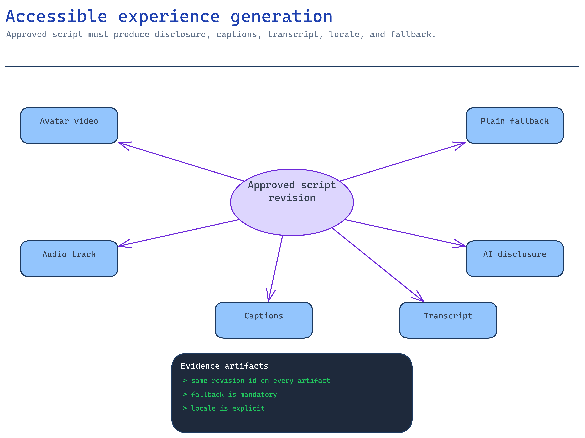

# Module 5 — Generate the accessible avatar experience

Now you render the experience — but only from an **approved script revision**, and only with the
accessibility and disclosure guarantees a synthetic presenter legally and ethically requires. A great
avatar with no transcript, no caption, no disclosure, and no non-avatar path is a compliance
incident, not a demo.

Current Speech guidance is cited inline where the implementation depends on service behavior.



## What you build

1. The rendered experience (a talking-avatar video, a real-time stream, a Voice Live session, or
   plain audio) produced from the approved artifact.
2. **Disclosure** that the presenter is synthetic/AI-assisted, shown/spoken to the user.
3. **Captions + a transcript** and a **non-avatar fallback** (an accessible HTML/audio path) that
   carry the same approved content.
4. **Locale handling** so the right voice/language is used per cohort.

The pack contract is [`accelerator/content_pack.py`](../accelerator/content_pack.py): a deterministic,
offline module that validates the approved pack and builds a traceable artifact record **without
calling a paid service or embedding any real likeness**. It is how you rehearse the pipeline safely;
the real Speech call is the same shape.

## Choose your path

The capability you chose in module 1 decides how you render. All four carry the **same** disclosure +
accessibility obligations.

| Option | How you generate | Output | Latency | Best when |
| --- | --- | --- | --- | --- |
| **A. Batch avatar synthesis** *(default)* | REST job: submit SSML → poll → download mp4 | Reviewable video file | Async (seconds–minutes) | Pre-produced onboarding you approve once and replay |
| B. Real-time avatar | Speech SDK + WebRTC stream | Live avatar in the browser | Sub-second | An interactive kiosk/agent showing a face |
| C. Voice Live (avatar or audio) | Managed speech-to-speech WebSocket | Live spoken (optionally avatar) agent | Sub-second | A conversational onboarding assistant |
| D. Plain audio | TTS narration | Audio + transcript | Either | Accessibility-first / lowest risk — **and the mandatory fallback for A–C** |

**Default: Option A.** It produces a concrete artifact that flows through module 6's approval gate,
uses a standard avatar/voice (no talent gating), and is the cheapest governed path. Every option must
still ship the Option D fallback.

**Migration cost.** A → B/C is the batch→streaming rebuild from module 1 (WebRTC/TURN or Voice Live
client). Any → D is trivial. Do not skip D "for now" — it is the accessible path, not an extra.

## Implementation

### Option A — Batch avatar synthesis (default)

**Build the request from an approved pack, not free text.** The pack contract in
[`content_pack.py`](../accelerator/content_pack.py) rejects the pack unless every script segment's
spoken text is an exact approved claim, all required approvals are present, and the disclosure
appears in both the transcript and the HTML fallback. Use it to turn the approved artifact into the
synthesis request body, with no Azure call and no likeness:

```bash
python3 -c "import sys; from pathlib import Path; \
sys.path.insert(0, 'scenarios/avatar-onboarding/accelerator'); \
from content_pack import validate_pack, build_artifact; \
pack = validate_pack(Path('scenarios/avatar-onboarding/accelerator/sample-data')); \
print(build_artifact(pack))"
```

A pack whose spoken text is not an exact approved claim raises `PackRejectedError`. That is the
accessibility + grounding gate in code, before any Azure call.

**Submit the real batch job (verified API).** The approved artifact becomes an SSML batch request:

```
PUT https://{resource}.cognitiveservices.azure.com/avatar/batchsyntheses/{SynthesisId}?api-version=2024-08-01
```

```json
{
  "inputKind": "SSML",
  "inputs": [{ "content": "<speak version='1.0' xml:lang='en-US'><voice name='en-US-AvaMultilingualNeural'>Complete your benefits selection in the employee portal during your first week.</voice></speak>" }],
  "avatarConfig": {
    "talkingAvatarCharacter": "lisa",
    "talkingAvatarStyle": "casual-sitting",
    "videoFormat": "Mp4",
    "subtitleType": "soft_embedded"
  }
}
```

Poll `GET …/batchsyntheses/{id}` until `status` is `Succeeded`, then download `outputs.result`
(the mp4). Keyless: send an Entra bearer token in the `Authorization` header; redact the token in
logs and docs. This works only when module 2 set the custom subdomain. Limits: payload ≤ 500 KB,
≤ 200 concurrent jobs, ≤ 20-minute output.
<https://learn.microsoft.com/azure/ai-services/speech-service/text-to-speech-avatar/batch-synthesis-avatar>

`subtitleType: soft_embedded` gives you captions in the video; you still ship the standalone
transcript and HTML fallback for the accessible path.

### Option B — Real-time avatar

Use the Speech SDK to open a WebRTC session: fetch ICE details from the Speech REST API, create the
peer connection, then `new SpeechSDK.AvatarConfig("lisa", "casual-sitting")` and a voice such as
`en-US-Ava:DragonHDLatestNeural`. Requires **Standard S0** and outbound access to
`relay.communication.microsoft.com` (UDP 3478 / TCP 443). Show the disclosure in the UI before the
avatar speaks, render live captions, and keep the Option D fallback one click away.
<https://learn.microsoft.com/azure/ai-services/speech-service/text-to-speech-avatar/real-time-synthesis-avatar>

### Option C — Voice Live (avatar or audio)

Voice Live is the managed speech-to-speech path and can emit avatar visuals. Bind it to the module-4
agent (agent mode, Entra auth) so spoken answers stay grounded. This is exactly the
[Voice Live activity](../../../activities/extra-voice-live/README.md) — build it there. Disclose the
synthetic voice at session start (spoken and on-screen) and offer the transcript/fallback.
<https://learn.microsoft.com/azure/ai-services/speech-service/voice-live>

### Option D — Plain audio (and the mandatory fallback)

Synthesize the approved claims as narration with a standard neural voice, ship the transcript, and
serve the `accessible-fallback.html` page (semantic HTML, `lang` set, `<main>` landmark) that carries
the same content without an avatar. This is what a screen-reader user, a low-bandwidth user, or
anyone who opts out of the avatar receives. The sample fallback is
[`accessible-fallback.html`](../accelerator/sample-data/accessible-fallback.html).

### Disclosure & accessibility are non-negotiable (verified)

- **Disclose the synthetic nature** of the voice/avatar to users — required for standard *and*
  custom. Design guidance:
  <https://learn.microsoft.com/azure/foundry/responsible-ai/speech-service/text-to-speech/concepts-disclosure-guidelines>
- **Never** render a real person's face or voice in this repo or a demo. Custom likeness requires the
  limited-access + consent path from module 1.
- Ship captions, a transcript, and a non-avatar fallback for every option — the renderer enforces
  their presence.

## Verify

Render one approved segment for real, then confirm the experience ships the disclosure and
accessibility artifacts a synthetic presenter requires.

**1. Submit a batch synthesis job with your Entra token and watch the result.** This proves keyless
Speech and gives you an artifact to inspect. Submit one approved claim as SSML:

```bash
set -a; source scenarios/avatar-onboarding/accelerator/.env; set +a
TOKEN=$(az account get-access-token --scope https://cognitiveservices.azure.com/.default --query accessToken -o tsv)
JOB=onb-verify-001

curl -s -X PUT -H "Authorization: Bearer $TOKEN" -H "Content-Type: application/json" \
  "$AZURE_SPEECH_ENDPOINT/avatar/batchsyntheses/$JOB?api-version=2024-08-01" \
  -d '{
    "inputKind": "SSML",
    "inputs": [{"content": "<speak version=\"1.0\" xml:lang=\"en-US\"><voice name=\"en-US-AvaMultilingualNeural\">Complete your benefits selection in the employee portal during your first week.</voice></speak>"}],
    "avatarConfig": {"talkingAvatarCharacter": "lisa", "talkingAvatarStyle": "casual-sitting", "videoFormat": "Mp4", "subtitleType": "soft_embedded"}
  }' | jq '{id, status}'

# Poll until Succeeded, then read the output URL:
curl -s -H "Authorization: Bearer $TOKEN" \
  "$AZURE_SPEECH_ENDPOINT/avatar/batchsyntheses/$JOB?api-version=2024-08-01" | jq -r '.status, .outputs.result'
```

`status` moves `NotStarted → Running → Succeeded`. Download `outputs.result` (a time-limited SAS
URL) and play the mp4. What "good" looks like: the standard `lisa` avatar speaking the exact
approved wording, with soft-embedded captions. A `401` means no custom subdomain (module 2); a `403`
means you lack **Cognitive Services Speech User**, so grant the role rather than using a Speech key.
If you see a real person's face, stop: that is a custom-avatar path that needs limited-access
approval and talent consent (module 1).
<https://learn.microsoft.com/azure/ai-services/speech-service/text-to-speech-avatar/batch-synthesis-avatar>

**2. The experience carries a disclosure, and the non-avatar fallback carries the same content.** A
video with no disclosure and no accessible path is a compliance incident, not a demo:

```bash
jq -e '.disclosure | length > 0' \
  scenarios/avatar-onboarding/accelerator/sample-data/storyboard-script.json

grep -qi 'avatar-generated or AI-assisted' scenarios/avatar-onboarding/accelerator/sample-data/transcript.txt \
  && grep -qi 'benefits selection' scenarios/avatar-onboarding/accelerator/sample-data/accessible-fallback.html \
  && grep -qi 'lang=' scenarios/avatar-onboarding/accelerator/sample-data/accessible-fallback.html \
  && echo "disclosure + fallback carry the approved content"
```

Both must succeed. A missing disclosure means an undisclosed synthetic presenter reaches users; a
fallback that omits the approved wording or a `lang` attribute excludes screen-reader and
low-bandwidth users. Ship captions, a transcript, and the non-avatar page for every option.
<https://learn.microsoft.com/azure/foundry/responsible-ai/speech-service/text-to-speech/concepts-disclosure-guidelines>

## Troubleshooting

| Symptom | Cause | Fix |
| --- | --- | --- |
| Renderer rejects the pack | A segment's spoken text isn't an exact approved claim, or an approval/disclosure is missing | Fix the script to use exact claims; complete approvals (module 6) |
| `401` submitting the batch job | No custom subdomain / wrong role | Module 2 sets the subdomain; assign **Cognitive Services Speech User** |
| `400 unsupported voice/locale` | Voice not available for the input language | Pick a voice that supports the locale; verify in language-and-voice support |
| Custom avatar/voice rejected | Limited access not approved | File <https://aka.ms/customneural>; ship a **standard** avatar until approved |
| Real-time avatar won't stream | WebRTC/TURN egress blocked | Allow `relay.communication.microsoft.com` UDP 3478 / TCP 443 |
| Job exceeds limits | > 20 min output or > 500 KB payload | Split into segments; keep each job within limits |
| Captions present but no transcript | Relied on embedded subtitles only | Ship the standalone transcript + HTML fallback too |

## Decision record

Keep: chosen generation option and why; the avatar character/style and voice (confirm **standard**,
not custom, unless the limited-access path is approved); the disclosure wording and where it appears
(spoken + on-screen + transcript + fallback); the accessibility artifacts shipped; and the locales
covered. Note the artifact id and its trace hash so module 6 can approve *this exact* revision.

## Next module

[Module 6 — Gate publication behind human approval](06-approval-gating.md) requires named human
sign-off and a withdrawal path before anything reaches an employee.
