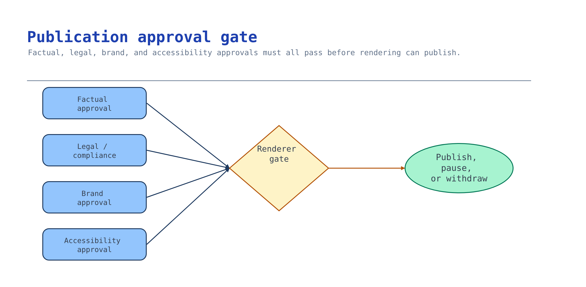

# Module 6 — Gate publication behind human approval

A synthetic presenter multiplies the cost of a mistake: it's confident, on-brand, and replayed to
every new hire. So nothing publishes without **named human sign-off**, and anything published can be
**withdrawn** the moment its source changes. This module makes the approval gate real and tests that
it actually blocks.



## What you build

1. A versioned **approval record** tying named humans to the exact script id + version they signed.
2. A **gate**: the experience cannot publish unless every required role has approved *this* revision.
3. A **withdrawal path**: flipping the approval status (e.g. after a source change) blocks
   publication even if all sign-offs exist.

The approval record template is
[`accelerator/sample-data/approvals.json`](../accelerator/sample-data/approvals.json), enforced by
[`mock_renderer.py`](../accelerator/mock_renderer.py).

## Choose your path

Where does the approval gate live and who enforces it?

| Option | Where approvals live | Enforcement | Build effort | Best when |
| --- | --- | --- | --- | --- |
| **A. Versioned approval record + renderer gate** *(default)* | JSON record versioned with the script | The renderer refuses unapproved/withdrawn packs | Low | You want a portable, auditable gate that travels with the artifact |
| B. Azure DevOps / GitHub environment approvals | Pipeline environment protection rules | Release pipeline blocks on required reviewers | Medium | Publishing is already a CI/CD release |
| C. Power Automate / Logic Apps approval flow | Approvals in M365/Teams | Flow gates the publish action | Medium | Approvers live in Teams and want native approvals |
| D. ITSM change request (ServiceNow etc.) | Change management system | Change ticket must be approved before publish | Higher | Regulated orgs requiring formal change control |

**Default: Option A.** A signed, versioned record that the renderer enforces is the smallest gate
that is also auditable and portable: the approval travels with the artifact, and the enforcement is
in code you can test (this module's checkpoint literally proves the gate blocks). Graduate to **B/C/D**
when the customer's existing release, collaboration, or change-control process must own the sign-off —
but keep the same **four required roles** and the **withdrawal** semantics.

**Migration cost.** A → B/C/D wraps the same record in a heavier workflow; the record and roles
survive. Do not drop the versioned record when you adopt a workflow tool — it is your audit trail.

## Implementation

### Option A — Versioned approval record + renderer gate (default)

**Require four named human approvals**, each tied to the exact revision. The renderer's
`REQUIRED_APPROVER_ROLES` is the contract: `SME`, `legal-compliance`, `brand-communications`,
`content-owner`.

```json
{
  "approval_record_id": "DEMO-APPROVAL-ONB-WELCOME-001-0.1.0",
  "script_id": "ONB-WELCOME-001",
  "script_version": "0.1.0",
  "approval_status": "approved-for-demo-only",
  "approvals": [
    { "role": "SME",                  "decision": "approved", "approver": "named-demo-sme",            "decided_at": "2026-07-05T09:00:00Z" },
    { "role": "legal-compliance",     "decision": "approved", "approver": "named-demo-legal-reviewer", "decided_at": "2026-07-05T09:10:00Z" },
    { "role": "brand-communications", "decision": "approved", "approver": "named-demo-brand-reviewer", "decided_at": "2026-07-05T09:20:00Z" },
    { "role": "content-owner",        "decision": "approved", "approver": "named-demo-content-owner",  "decided_at": "2026-07-05T09:30:00Z" }
  ]
}
```

Why these four for a synthetic onboarding experience:
- **SME** — the facts are correct.
- **legal-compliance** — disclosure, consent, and regulated claims are satisfied.
- **brand-communications** — the avatar, voice, and tone represent the org acceptably.
- **content-owner** — accountable for the published wording and its expiry.

The record must match the **exact** `script_id` + `script_version`. Approving 0.1.0 does not approve
0.2.0 — re-approval is required for every revision. That is the whole point: a small edit to a
policy sentence forces a fresh human decision.

**Implement withdrawal.** When module 3 reports a source change (a claim invalidated, past
`review_by`), flip the status and republish nothing:

```python
import json
from pathlib import Path
p = Path("scenarios/avatar-onboarding/accelerator/sample-data/approvals.json")
record = json.loads(p.read_text())
record["approval_status"] = "withdrawn"        # was: approved-for-demo-only
p.write_text(json.dumps(record, indent=2))
# The renderer now rejects the pack: the experience is paused until re-approval.
```

### Option B — Pipeline environment approvals

Model publish as a release to a protected environment with required reviewers. The pipeline reads the
approval record, and the environment protection rule enforces the human gate before the publish step
runs. Keep the versioned record as the artifact the reviewers approve.

### Option C — Power Automate / Logic Apps

Trigger an approval flow to the four roles in Teams; on full approval the flow calls the publish
action (upload to `experience-output`, flip a "published" flag). On any rejection or a later source
change, the flow triggers withdrawal. Approvers stay in their tools; the record stays the audit
trail.

### Option D — ITSM change control

Bind publication to an approved change request. The avatar experience is a change; the CR references
the approval record and the artifact hash. Withdrawal is a follow-up change. Use this when the
customer's governance demands formal change management.

## Verify

```bash
python3 scenarios/avatar-onboarding/accelerator/scripts/verify_approval.py
```

Expected:

```
== Module 6 checkpoint: human approval gate ==
PASS  all required approver roles present (missing: none)
PASS  fully-approved pack is accepted (publication is allowed)
PASS  removing the 'SME' approval blocks publication
PASS  removing the 'brand-communications' approval blocks publication
PASS  removing the 'content-owner' approval blocks publication
PASS  removing the 'legal-compliance' approval blocks publication
PASS  withdrawing the approval status blocks publication

✅ Module 6 checkpoint PASS — publication requires approval and withdrawal blocks it
```

The check proves the gate **negatively**: it removes each required approval in turn and confirms
publication is blocked, then confirms that withdrawing the status blocks a fully-signed pack. A gate
that never blocks proves nothing — this one is tested by trying to break it.

## Troubleshooting

| Symptom | Cause | Fix |
| --- | --- | --- |
| Pack publishes with a missing role | Gate checks presence, not completeness | Enforce all four `REQUIRED_APPROVER_ROLES`; the check fails if any is absent |
| Old revision still publishes | Approval not bound to `script_version` | Match `script_id` + `script_version` exactly; re-approve every revision |
| Withdrawn content still served | No withdrawal enforcement | Flip `approval_status`; renderer must reject non-approved statuses |
| Approver name blank | Unattributed approval | Require a named `approver` and `decided_at` per row |
| Source changed, nobody notified | Missing invalidation wiring | Wire module 3's expiry/source-change to auto-withdraw |
| "Approved" but no audit trail | Approval outside the versioned record | Keep the versioned record even with a workflow tool (B/C/D) |

## Decision record

Keep: chosen gate option and why; the four required roles and who fills each; the rule that approval
binds to an exact `script_id`+`script_version`; the withdrawal trigger ("source change / expiry ⇒
withdraw ⇒ pause"); and one worked example of a blocked publication. This record plus the signed
approval record are your audit trail.

## Next module

[Module 7 — Evaluate, red-team, trace, and operate](07-prove-and-operate.md) proves the experience is
safe and useful, then makes the controlled release decision.
