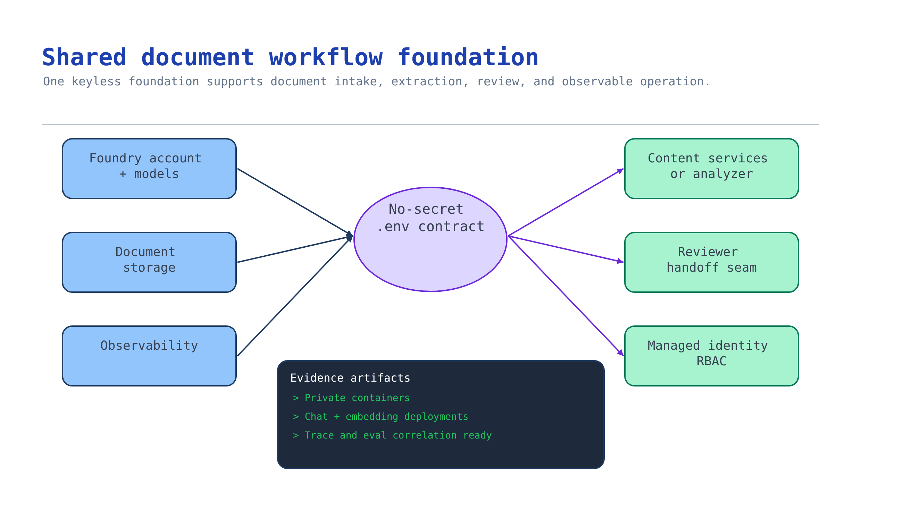

# Module 1 — Provision the shared Foundry foundation

Every later module writes into the footprint you create here. Content Understanding and Document
Intelligence are **Foundry Tools on a Microsoft Foundry (AIServices) resource** — the same account
that hosts your model deployments. Get the identity model and region right now and modules 2–7 are
configuration; get it wrong and you redeploy.



## What you build

A resource group containing:

| Resource | Why the document workflow needs it |
| --- | --- |
| Foundry account (`AIServices`) + project | Hosts Content Understanding, Document Intelligence, and the model deployments they call |
| Chat/generative deployment | Content Understanding generative & classify fields, and LLM structured-output extraction |
| Embedding deployment | Content Understanding custom analyzers and knowledge sources |
| Storage account + `documents-inbound` container | The approved document source that modules 2–4 read |
| Storage `documents-quarantine` container | Isolates documents that fail intake controls |
| Log Analytics + Application Insights | Workflow tracing and the evaluation gate in modules 6–7 |
| Role assignments | Keyless access between the account identity, storage, and the engineer |

Output: a `.env` contract with **no secrets in it**, consumed by every later module.

## Choose your path

| Option | Reproducible | Creates storage + embedding | Best when | Cost while idle |
| --- | --- | --- | --- | --- |
| **A. Scenario Bicep** *(default)* | Yes, reviewable IaC | Yes | You are building this workflow for a customer | Idle model deployments + Log Analytics; storage is pennies |
| B. `azd up` (kit root infra) | Yes | No — chat + Search only, no doc storage/embedding | You are running the whole starter kit end to end | Same, plus AI Search + ACR |
| C. Foundry portal / Content Understanding Studio | No | Manual | A throwaway demo of an analyzer | Lowest |
| D. Bring your own landing zone | Customer's IaC | Depends on what exists | The customer already has a governed Foundry resource | Already owned |

**Default: Option A.** It is the only path that provisions *both* the embedding deployment and the
inbound + quarantine containers modules 2–4 require, and it produces a diff a platform team can review.

**Migration cost.** A → D is cheap: modules 2+ only read the `.env` contract, so pointing at customer
resources is a variable change. C → A is expensive: portal/Studio resources have generated names and
no template, so you rebuild. Do not demo from C and then promise A.

### Region and model availability come first

Content Understanding and Document Intelligence are not in every region, and your models must deploy
in the region you pick. Check both **before** deploying:

```bash
az cognitiveservices account list-skus --location eastus2 --kind AIServices -o table
```

- Content Understanding region support:
  <https://learn.microsoft.com/azure/ai-services/content-understanding/language-region-support>
- Document Intelligence region availability:
  <https://azure.microsoft.com/en-us/explore/global-infrastructure/products-by-region/>

> **API versions to pin.** Content Understanding GA is **`2025-11-01`** (the
> `2024-12-01-preview` / `2025-05-01-preview` previews retire 2026-07-15). Document Intelligence GA
> is **v4.0 `2024-11-30`**. Content Understanding needs default model deployments — `gpt-4.1-mini`
> works today, but the GPT-4.1 family retires October 2026, so plan to migrate to `gpt-5.2`.
> Sources: <https://learn.microsoft.com/azure/ai-services/content-understanding/choosing-right-ai-tool>,
> <https://learn.microsoft.com/azure/ai-services/document-intelligence/overview?view=doc-intel-4.0.0>

## Implementation

### Option A — Scenario Bicep (default)

The template is [`accelerator/main.bicep`](../accelerator/main.bicep); defaults live in
[`accelerator/parameters.example.json`](../accelerator/parameters.example.json).

```bash
az login
az account set --subscription "<subscription-id>"

# Compile before you deploy — catches schema errors without touching Azure.
bicep build scenarios/content-understanding/accelerator/main.bicep --stdout > /dev/null

./scenarios/content-understanding/accelerator/scripts/deploy.sh rg-content-understanding eastus2
```

`deploy.sh` creates the resource group, validates the template, deploys, then writes
`accelerator/.env` from the outputs. It passes your signed-in object ID as `principalId` so you get
keyless data-plane access without anyone issuing a key.

What the template does that matters, and why:

```bicep
// Keyless-first: shared key access is OFF, so intake must use Entra ID.
allowSharedKeyAccess: false

// The account's managed identity reads inbound documents when analyzing by URL.
resource foundryToStorageRole 'Microsoft.Authorization/roleAssignments@2022-04-01' = {
  scope: storage
  properties: {
    principalId: foundry.identity.principalId
    roleDefinitionId: roleStorageBlobDataReader
    principalType: 'ServicePrincipal'
  }
}
```

To deploy into an existing resource group without creating one:

```bash
az deployment group create \
  --resource-group <existing-rg> \
  --template-file scenarios/content-understanding/accelerator/main.bicep \
  --parameters @scenarios/content-understanding/accelerator/parameters.example.json \
  --parameters principalId="$(az ad signed-in-user show --query id -o tsv)"
```

### Option B — `azd up` (kit root infra)

Use when you want the shared footprint every activity in the kit uses. It provisions Foundry +
project + a **chat** deployment + AI Search + observability, but **not** the document storage or the
embedding deployment. Add them before module 2:

```bash
azd up
azd env get-values > scenarios/content-understanding/accelerator/.env

RG=$(azd env get-value AZURE_RESOURCE_GROUP)
ACCOUNT=$(azd env get-value AZURE_AI_FOUNDRY_NAME)

az cognitiveservices account deployment create \
  --resource-group "$RG" --name "$ACCOUNT" \
  --deployment-name embedding \
  --model-name text-embedding-3-large --model-version 1 --model-format OpenAI \
  --sku-name Standard --sku-capacity 30

az storage account create --resource-group "$RG" --name "st${RANDOM}cudoc" \
  --sku Standard_LRS --allow-shared-key-access false
az storage container create --account-name "st${RANDOM}cudoc" --name documents-inbound --auth-mode login
az storage container create --account-name "st${RANDOM}cudoc" --name documents-quarantine --auth-mode login
```

Then append `AZURE_AI_EMBEDDING_DEPLOYMENT_NAME`, `AZURE_STORAGE_ACCOUNT_NAME`,
`AZURE_DOCUMENTS_CONTAINER_NAME`, `AZURE_QUARANTINE_CONTAINER_NAME`,
`AZURE_CONTENT_UNDERSTANDING_ENDPOINT`, and `AZURE_DOCUMENT_INTELLIGENCE_ENDPOINT` to the `.env`.

This module maps to **Foundations Step 1** — see [the canonical activity](../../../activities/foundations/README.md).

### Option C — Foundry portal / Content Understanding Studio

For a same-day analyzer demo. Create a Foundry resource in the portal, then open Content
Understanding Studio (<https://contentunderstanding.ai.azure.com>) and let it auto-deploy the
required `gpt-4.1`, `gpt-4.1-mini`, and `text-embedding-3-large` models. Record the endpoint and
deployment names into `accelerator/.env` by hand.

Accept the trade: no template, generated names, nothing for a platform team to review. Treat anything
built here as disposable. Do not build the pilot on it.

### Option D — Bring your own landing zone

No new resources. Verify what exists and fill the same contract.

```bash
az cognitiveservices account list \
  --query "[?kind=='AIServices'].{name:name,rg:resourceGroup,loc:location}" -o table
```

Then confirm the three things this scenario depends on:

1. The account has `allowProjectManagement: true` (it is a Foundry account).
2. It exposes Content Understanding and Document Intelligence in its region.
3. The account identity holds **Storage Blob Data Reader** on the document storage, and your identity
   holds **Cognitive Services User** + **Cognitive Services OpenAI User** on the account.

```bash
ACCOUNT_ID=$(az cognitiveservices account show -g <rg> -n <account> --query id -o tsv)
az role assignment create --assignee "$(az ad signed-in-user show --query id -o tsv)" \
  --role "Cognitive Services User" --scope "$ACCOUNT_ID"
```

Write discovered values into `accelerator/.env` using the same variable names the template outputs,
so modules 2–7 are identical across all four options.

## Verify

```bash
python3 scenarios/content-understanding/accelerator/scripts/verify_foundation.py
```

Expected:

```
✅ Module 1 checkpoint PASS — foundation is provisioned and keyless
```

The checkpoint asserts the contract is complete, contains **no** key/secret variables, that the chat
and embedding deployments exist, and that both blob containers answer using Entra ID. Run it with
`--offline` to check structure only, without calling Azure.

## Troubleshooting

| Symptom | Cause | Fix |
| --- | --- | --- |
| `401` / `403` from the account | Missing data-plane roles; RBAC takes minutes to propagate | Assign **Cognitive Services User** + **Cognitive Services OpenAI User**, wait ~5 min, re-run |
| Deployment fails on the model | Model or capacity unavailable in the region | `az cognitiveservices account list-skus --location <region> --kind AIServices -o table`, then change region or lower `chatModelCapacity` |
| Both deployments fail together | Deployments on one account serialize | The template sets `dependsOn` on the embedding deployment; do not remove it |
| `StorageAccountAlreadyTaken` | `resourceToken` collides globally | Pass a different `resourceToken` (5–12 lowercase chars) |
| Content Understanding calls 404 | Wrong endpoint host or unsupported region | Use `AZURE_CONTENT_UNDERSTANDING_ENDPOINT` from the outputs; confirm the region supports the service |
| `.env` written but empty | Deployment succeeded with no outputs | Check `accelerator/.deployment-outputs.json`; re-run the deployment |

## Decision record

Record and keep: chosen option and why, region and the availability evidence behind it, chat and
embedding model + version, the Content Understanding and Document Intelligence API versions you
pinned, whether local auth is disabled, and who owns the resource group. One short paragraph plus the
`.env` variable names — not the values.

## Next module

[Module 2 — Connect an approved document source](02-document-source.md) decides where trusted
documents come from and how intake controls keep unapproved content out.
