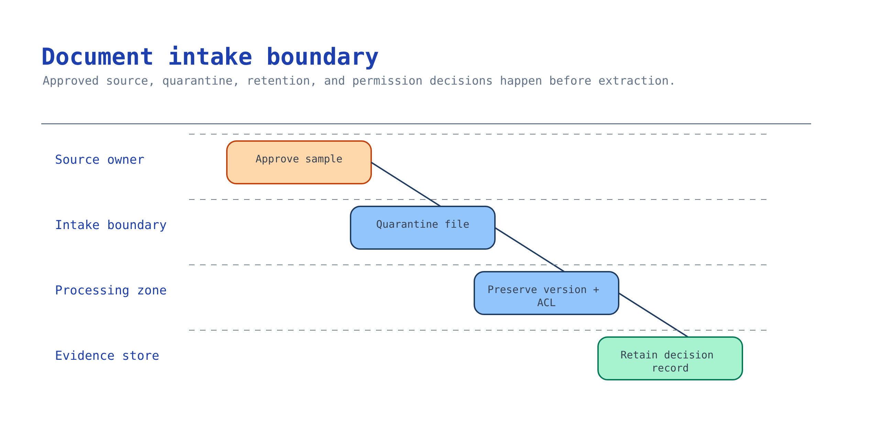

# Module 2 — Connect an approved document source

This module decides which documents are allowed to enter the workflow and how their identity,
version, and permissions travel with them. Extraction quality can be tuned later; letting an
unapproved document in is discovered by the wrong person.



## What you build

1. A source decision: which system is authoritative for the documents you extract.
2. An intake contract: the metadata every document carries (source URI, version, owner, hash,
   sensitivity), and the rules that send a document to quarantine instead of extraction.
3. A **runnable intake check** that proves the plan is complete and the containers are keyless and
   private.

## Choose your path

| Option | Reaches | Permission model | Build effort | Status |
| --- | --- | --- | --- | --- |
| **A. Azure Blob Storage** *(default)* | Files you upload / land via pipeline | RBAC on the container; account MI reads by URL | Low | GA |
| B. ADLS Gen2 | Hierarchical lake data | POSIX ACLs (≤32 per file) + RBAC; ACLs can carry forward to a search index | Medium | GA |
| C. SharePoint | Documents users already own | Inherited M365 / Entra permissions; indexer or Graph | Medium | Indexed = preview, Remote = preview |
| D. OneLake (lakehouse) | Fabric lakehouse files | Fabric workspace RBAC | Medium | GA as a knowledge source |

**Default: Option A.** Blob is the simplest approved-content boundary: one container the account's
managed identity reads by URL, RBAC you control, and a second container for quarantine. Content
Understanding and Document Intelligence both accept a blob URL directly, so no extra pipeline is
needed to get a document to the analyzer.

**Choose B when** the documents already live in a data lake and you need directory-level ACLs to
travel with them. **Choose C when** the answer is "these are SharePoint documents and the owners
should keep managing permissions there" — do not copy them into blob and fork the permission model.
**Choose D when** the documents are curated in a Fabric lakehouse alongside analytical data.

**Migration cost.** A → B/C/D changes only the ingestion step and the `source_kind` in your intake
plan; the extraction and review modules read the same typed result, so they are unaffected. C → A is
a copy plus a new permission design — expensive, and usually the wrong direction.

### The intake decision, stated precisely

Answer these before writing code:

1. **Which system is authoritative** for each document class, and who owns it?
2. **What metadata must travel** with every document — source URI, version, ingested-by, SHA-256,
   sensitivity label, permission owner IDs?
3. **What sends a document to quarantine** — unapproved class, unauthorized source, unsupported type
   or size, missing sensitivity label?
4. **How long is a document retained**, and who signed off on that window?

Capture the answers in [`accelerator/sample-data/workflow/intake-plan.json`](../accelerator/sample-data/workflow/intake-plan.json).

## Implementation

### Option A — Azure Blob Storage (default)

The template already created `documents-inbound` and `documents-quarantine` with shared-key access
off. Upload approved documents keylessly and stamp intake metadata as blob metadata:

```bash
ACCOUNT=$(grep AZURE_STORAGE_ACCOUNT_NAME accelerator/.env | cut -d= -f2)

az storage blob upload \
  --account-name "$ACCOUNT" --auth-mode login \
  --container-name documents-inbound \
  --name invoice-2002.pdf --file ./invoice-2002.pdf \
  --metadata source_uri="procurement/2026/invoice-2002.pdf" source_version="1" \
             ingested_by="$(az ad signed-in-user show --query userPrincipalName -o tsv)" \
             sensitivity_label="Confidential"
```

Anything that fails a rule goes to `documents-quarantine`, never `documents-inbound`. Because the
account's managed identity holds **Storage Blob Data Reader** (module 1), the analyzers read
`https://<account>.blob.core.windows.net/documents-inbound/<name>` by URL with no key.

### Option B — ADLS Gen2

Same storage account with hierarchical namespace enabled. Set directory ACLs so permissions travel
with the document, and record that you will carry them forward when the content is indexed:

```bash
az storage fs access set \
  --account-name "$ACCOUNT" --auth-mode login \
  --file-system documents-inbound --path procurement \
  --acl "user::rwx,group::r-x,other::---"
```

Know the limit before you promise anything: **≤32 ACL entries per file/directory**. Past that,
redesign to group-based permissions. Reference:
<https://learn.microsoft.com/azure/search/search-indexer-access-control-lists-and-role-based-access>

### Option C — SharePoint

Do not copy the documents. Connect the SharePoint library and let M365 keep enforcing permissions,
evaluated as the signed-in user. As a knowledge source, SharePoint is available **indexed** (ingested
before query time) or **remote** (fetched at query time) — both preview as of 2026-07-24. For a
document-extraction workflow you typically pull a specific file via Microsoft Graph and hand its
bytes or a short-lived URL to the analyzer.

The governance work is the same regardless: confirm the library's permissions reflect intent
(inherited permissions on a "public" site are the usual surprise) and test with a low-privilege
account. Reference: <https://learn.microsoft.com/azure/search/agentic-knowledge-source-overview>

### Option D — OneLake (lakehouse)

When documents are curated in a Fabric lakehouse, reference the OneLake path and let Fabric workspace
RBAC govern access. OneLake is a GA knowledge source kind; permissions are enforced by Fabric, not
copied into a separate store. Reference: <https://learn.microsoft.com/fabric/iq/overview>

## Verify

```bash
# Structure only, no Azure calls
python3 scenarios/content-understanding/accelerator/scripts/verify_document_source.py --offline

# Live: confirm both containers exist, are reachable keyless, and are private
python3 scenarios/content-understanding/accelerator/scripts/verify_document_source.py
```

Expected:

```
✅ Module 2 checkpoint PASS — the approved source and intake controls are defined
```

The check asserts a supported `source_kind`, that source identity/version/permission metadata is
retained, that inbound and quarantine containers are named, that quarantine rules and a retention
window exist, and (live) that the containers are private and reachable without a key.

## Troubleshooting

| Symptom | Cause | Fix |
| --- | --- | --- |
| `403` on `az storage blob upload` | Missing **Storage Blob Data Contributor** on your identity | Assign it at the storage scope; wait ~5 min; use `--auth-mode login` |
| Analyzer can't read the blob later | Account MI lacks **Storage Blob Data Reader** | Module 1's role assignment covers this; confirm it exists |
| `AuthorizationFailure` with `--account-key` | Shared key access is disabled by design | Use `--auth-mode login`, never a key |
| SharePoint returns nothing for some users | Inherited site permissions differ from intent | Fix permissions in SharePoint; retest with a low-privilege account |
| Revoked user still reaches indexed content | ACL staleness after ingestion | Resync the indexer; parent-scope changes need a full resync |
| Documents pile up unprocessed | No quarantine rule caught an unapproved class | Add the rule to the intake plan; route failures to `documents-quarantine` |

## Decision record

One page, kept with the pilot: the chosen source and the runners-up with why each lost; the metadata
contract; the quarantine rules; the retention window and who signed it; and the intake check result
with a date.

## Next module

[Module 3 — Select the extraction capability](03-extraction-selection.md) chooses how these
documents become typed fields, across every Microsoft option.
