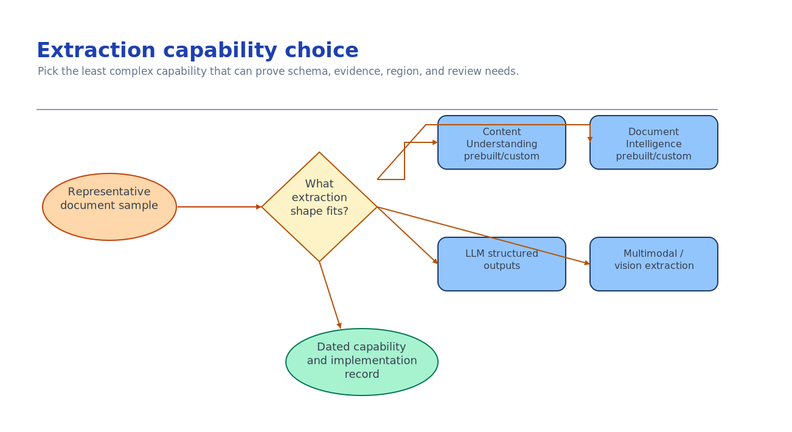

# Module 3 — Select the extraction capability

This is the module the customer actually came for. There are several valid Microsoft options and
each wins in a different place. Choosing wrong is expensive: a deterministic model on free-form
documents misses fields; an LLM on stable forms burns tokens and invents values. Decide on the
record, with a fallback.



## What you build

A recorded extraction decision: the capability, the concrete model or analyzer id, the API version, a
confidence threshold, an explicit requirement for evidence, and a named fallback with its trigger.
Captured in [`accelerator/sample-data/workflow/extraction-decision.json`](../accelerator/sample-data/workflow/extraction-decision.json).

## Choose your path

Use the current Microsoft Learn guidance when choosing the capability:
<https://learn.microsoft.com/azure/ai-services/content-understanding/choosing-right-ai-tool>

| Option | What it is | Confidence + grounding | Labels needed | Wins when | Fails when |
| --- | --- | --- | --- | --- | --- |
| **A. Content Understanding prebuilt analyzer** *(default)* | LLM-powered analyzers (`prebuilt-invoice`, `-contract`, `-read`, `-layout`, `-documentSearch`) | Yes (0–1 + source spans) | None | Semi-structured / high-variation docs, RAG prep, reasoning, multimodal | Ultra-high-volume, latency-critical, cost-sensitive stable forms |
| B. Content Understanding custom analyzer | Zero-shot schema you describe in plain language; optional labels/knowledge source | Yes (`estimateFieldSourceAndConfidence`) | None (zero-shot) or few | Custom fields on unstructured docs (policies, letters, notes) | You need deterministic template accuracy |
| C. Document Intelligence prebuilt model | Purpose-trained deterministic models (Invoice, Receipt, ID, tax, mortgage…) | Yes (0–1 + bounding regions) | None | Standard structured forms with common templates; low latency, proven accuracy | Free-form or highly variable layouts |
| D. Document Intelligence custom model | Template/neural model you train on labeled samples | Yes | Yes (labeled) | Highly structured, org-specific forms (claims, applications) | You have no labels or layouts vary a lot |
| E. LLM structured outputs (build your own) | Azure OpenAI JSON-schema extraction | **No native confidence/grounding** — you implement it | None | Niche workflows needing full control of model + prompt | You need built-in evidence or straight-through automation with audit |
| F. Multimodal / vision extraction | CU image/vision analyzers or a vision LLM over page images | Yes (CU) / No (raw vision) | None | Charts, diagrams, photos, handwriting, mixed media | Pure text where OCR + fields is cheaper and more accurate |

**Default: Option A.** Content Understanding prebuilt analyzers give schema-aligned fields *with
confidence and grounding* and no labeling, and the same service reaches Document Intelligence models
when you need them — so you can start here and specialize without changing stacks.

**When each other option wins**

- **B** — you need fields no prebuilt covers, on documents too variable for a template. Describe the
  fields in plain language; iterate in minutes.
- **C** — the documents are a standard structured form (invoice, receipt, ID, W-2, 1003). Deterministic
  models are the accuracy and latency leader here and cost less than an LLM per page.
- **D** — the form is org-specific and highly structured, and you can label samples. You trade labeling
  effort for template-grade accuracy.
- **E** — you need complete control of the model, prompt, and infrastructure, and you accept owning
  confidence and grounding yourself. This is the "build your own" path; pick it deliberately.
- **F** — the value is in a chart, diagram, photo, or handwriting. Use a multimodal analyzer; do not
  force a text-only pipeline over visual content.

**Migration cost.** A ↔ C is cheap: both are Foundry Tools on the same account and return the same
typed result contract (module 4), so you swap the analyzer/model id and re-verify. A/C → E is a
rebuild of the extraction step *plus* new validation code, because you inherit no confidence or
grounding. B and D add iteration/labeling loops but keep the result contract. Default toward the
options that hand you evidence for free.

## Implementation

Each option below produces the typed result module 4 consumes. Set the confidence threshold once and
enforce it everywhere.

### Option A — Content Understanding prebuilt analyzer

GA API version **`2025-11-01`**. Async: `POST …:analyze` → `202` + `Operation-Location`, then poll.

```bash
CU=$(grep AZURE_CONTENT_UNDERSTANDING_ENDPOINT accelerator/.env | cut -d= -f2 | sed 's:/*$::')
TOKEN=$(az account get-access-token --resource https://cognitiveservices.azure.com --query accessToken -o tsv)

curl -s -D - -X POST \
  "$CU/contentunderstanding/analyzers/prebuilt-invoice:analyze?api-version=2025-11-01" \
  -H "Authorization: Bearer $TOKEN" -H "Content-Type: application/json" \
  -d '{"inputs":[{"url":"https://<account>.blob.core.windows.net/documents-inbound/invoice-2002.pdf"}]}'
# → 202; copy the Operation-Location header, then GET it until "status":"Succeeded"
```

Each field comes back with `valueString`/`valueNumber`/`valueDate`, `spans` (offset/length),
`confidence`, and `source` (the grounding polygon). The full poll loop is in the scenario's
`accelerator/solution.md` reference implementation.

### Option B — Content Understanding custom analyzer

Create an analyzer that describes your fields and turns on evidence, then analyze with its id:

```bash
curl -s -X PUT \
  "$CU/contentunderstanding/analyzers/rvas-rfq?api-version=2025-11-01" \
  -H "Authorization: Bearer $TOKEN" -H "Content-Type: application/json" \
  -d '{
        "description": "RFQ fields for procurement",
        "config": { "estimateFieldSourceAndConfidence": true },
        "fieldSchema": { "fields": {
          "RfqNumber":   { "type": "string", "method": "extract" },
          "DueDate":     { "type": "date",   "method": "extract" },
          "TotalBudget": { "type": "number", "method": "extract" }
        }}
      }'
```

`estimateFieldSourceAndConfidence` is what makes confidence and grounding appear in the result — the
switch people forget. Field methods are **extract** (as-written), **classify** (from a set), or
**generate** (summaries/descriptions). Reference:
<https://learn.microsoft.com/azure/ai-services/content-understanding/overview>

### Option C — Document Intelligence prebuilt model

Deterministic, keyless, v4.0 GA (`2024-11-30`). `pip install azure-ai-documentintelligence`.

```python
from azure.identity import DefaultAzureCredential
from azure.ai.documentintelligence import DocumentIntelligenceClient
from azure.ai.documentintelligence.models import AnalyzeDocumentRequest
import os

client = DocumentIntelligenceClient(os.environ["AZURE_DOCUMENT_INTELLIGENCE_ENDPOINT"], DefaultAzureCredential())
poller = client.begin_analyze_document(
    "prebuilt-invoice",
    AnalyzeDocumentRequest(url_source="https://<account>.blob.core.windows.net/documents-inbound/invoice-2002.pdf"))
for doc in poller.result().documents:
    total = doc.fields["InvoiceTotal"]
    print(total.value_currency, total.confidence, total.bounding_regions)
```

Model ids include `prebuilt-invoice`, `prebuilt-receipt`, `prebuilt-idDocument`, `prebuilt-tax.us.w2`,
`prebuilt-layout`, `prebuilt-read`. Reference:
<https://learn.microsoft.com/azure/ai-services/document-intelligence/overview?view=doc-intel-4.0.0>

### Option D — Document Intelligence custom model

Label 5+ samples of one org-specific form in Document Intelligence Studio, train, then call the model
by its id exactly like Option C (`client.begin_analyze_document("<your-custom-model-id>", …)`). You
own the labeling loop; you get template-grade accuracy and per-field confidence.

### Option E — LLM structured outputs (build your own)

Full control, **no native confidence or grounding**. You must implement validation and evidence.

```python
from pydantic import BaseModel
from openai import OpenAI
from azure.identity import DefaultAzureCredential, get_bearer_token_provider

tp = get_bearer_token_provider(DefaultAzureCredential(), "https://ai.azure.com/.default")
client = OpenAI(base_url="https://<res>.openai.azure.com/openai/v1/", api_key=tp)

class Invoice(BaseModel):
    invoice_number: str
    total_due_usd: str

out = client.beta.chat.completions.parse(
    model="chat",
    messages=[{"role":"system","content":"Extract only fields present; never infer a value."},
              {"role":"user","content": document_markdown}],
    response_format=Invoice)
```

Because there is no confidence score, your evidence strategy must be explicit — e.g. require the model
to return the source span for each field and reject any field it cannot locate. Record that strategy
in the decision. Reference:
<https://learn.microsoft.com/azure/foundry/openai/how-to/structured-outputs>

### Option F — Multimodal / vision extraction

When the value lives in a chart, diagram, photo, or handwriting, use a Content Understanding image
analyzer (`prebuilt-imageSearch`, or a custom analyzer with `generate` fields) so you still get
confidence and grounding, or a vision-capable LLM over rendered page images if you are on Option E.
Do not push visual content through a text-only OCR path and hope.

This module and module 4 are the canonical
[Document Workflow activity](../../../activities/extra-document-workflow/README.md) — link to it
rather than duplicating its walkthrough.

## Verify

Prove the capability you picked on a real document, then on a messy one. A decision file that names
an analyzer is not evidence that the analyzer works on your documents.

**1. The chosen analyzer returns typed fields with confidence and grounding.**

For the Content Understanding default, analyze one real inbound document and read the result:

```bash
CU=$(echo "$AZURE_CONTENT_UNDERSTANDING_ENDPOINT" | sed 's:/*$::')
TOKEN=$(az account get-access-token --resource https://cognitiveservices.azure.com --query accessToken -o tsv)
OP=$(curl -s -D - -o /dev/null -X POST \
  "$CU/contentunderstanding/analyzers/prebuilt-invoice:analyze?api-version=2025-11-01" \
  -H "Authorization: ******" -H "Content-Type: application/json" \
  -d "{\"inputs\":[{\"url\":\"https://$AZURE_STORAGE_ACCOUNT_NAME.blob.core.windows.net/$AZURE_DOCUMENTS_CONTAINER_NAME/invoice-2002.pdf\"}]}" \
  | tr -d '\r' | awk '/^Operation-Location:/{print $2}')

# Poll until "status":"Succeeded", then inspect a field's confidence and source.
curl -s -H "Authorization: ******" "$OP" \
  | jq '.result.contents[0].fields | to_entries[0].value | {value: (.valueString // .valueNumber // .valueDate), confidence, source}'
```

A `confidence` between 0 and 1 and a non-null `source` (the `D(page,...)` grounding polygon) is the
signal that this capability hands you evidence for free. If `source` is null, you chose a path that
does not ground its values — for Option E that is expected and you owe the evidence strategy yourself.
For Document Intelligence, read `field.confidence` and `field.boundingRegions` from the SDK result
instead.

**2. It survives a document outside your happy path.**

Run the same call against a document with a different layout, a scan, or a vendor you did not design
for. Compare the returned fields to what you can see in the source document.

If fields you can read with your own eyes come back empty, or confidence collapses across the board,
you have found the failure that costs money: extraction that passed on the three clean samples and
falls over on the real corpus. That is the trigger for the fallback you recorded, not a reason to
lower the threshold until it looks fine.

## Troubleshooting

| Symptom | Cause | Fix |
| --- | --- | --- |
| Fields empty on a "simple" document | Deterministic model on a non-standard layout | Switch to a CU analyzer (A/B) that reasons over variable layouts |
| Confidence/grounding missing from a custom analyzer | `estimateFieldSourceAndConfidence` not set | Add it to the analyzer `config` and recreate the analyzer |
| `404` on the analyze call | Preview API version or wrong host | Pin `api-version=2025-11-01` (CU GA) and use the CU endpoint from `.env` |
| Costs spike per page | LLM path (E) on high-volume stable forms | Move to a DI prebuilt model (C) for those classes |
| Values look plausible but are wrong | LLM inferred a value (E) with no grounding | Require a source span per field and reject unlocatable fields |
| Handwriting/chart data dropped | Text-only pipeline over visual content | Use a multimodal analyzer (F) |

## Decision record

Short: the selected capability, model/analyzer id, API version, confidence threshold, the evidence
requirement, the two runners-up with why they lost, and the fallback plus its trigger. One paragraph,
with a date.

## Next module

[Module 4 — Implement typed extraction with evidence](04-typed-extraction.md) turns the chosen
capability's output into one validated result that fails safely.
