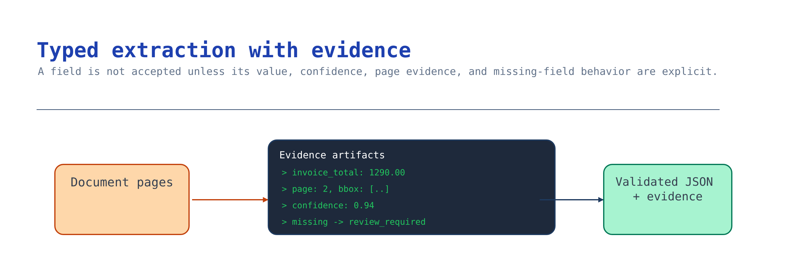

# Module 4 — Implement typed extraction with evidence

A demo that prints fields is insufficient. This module turns the capability from module 3 into **one
validated result contract**. Each value has confidence and grounding evidence. Missing or
low-confidence fields route to review, and the model never invents a value.



## What you build

A normalizer maps raw capability output into the typed result contract and enforces four invariants.
A validation step rejects any result that violates one.

The four invariants:

1. Every field with a value has `confidence` and non-empty grounding `evidence`. **A value without
   evidence is inferred and rejected.**
2. Any field below the confidence threshold is flagged `low_confidence:<field>` and forces review.
3. A missing/uncertain field is surfaced for review, never guessed.
4. `requires_human_review` and `routing_decision` agree with the flags.

## Choose your path

| Option | Source of confidence + evidence | Normalizer effort | Best when |
| --- | --- | --- | --- |
| **A. Map a Content Understanding result** *(default)* | `confidence` + `source`/`spans` per field | Low — evidence is already there | You chose CU prebuilt or custom (module 3 A/B/F) |
| B. Map a Document Intelligence result | `field.confidence` + `bounding_regions` | Low | You chose a DI prebuilt or custom model (module 3 C/D) |
| C. LLM output + self-reported grounding | You require a span per field and verify it | High — you build evidence + validation | You chose LLM structured outputs (module 3 E) |

**Default: Option A.** Content Understanding already returns confidence and a grounding source for
each field. The normalizer is a thin mapping, and the invariants are easy to enforce.

**Choose B** when you standardized on Document Intelligence models. Its shape differs, but it includes
the same evidence. **Choose C** only if you accepted module 3's build-your-own trade. You must then
implement evidence and validation.

**Migration cost.** Moving between A and B changes only the mapping. The contract and downstream
modules are identical. Moving from A or B to C adds a validation layer that needs the same care as
extraction.

## Implementation

**The snippets below are incomplete sketches, not a validated normalizer.** They do not yet
handle all required fields, nested values, missing confidence, or the full fixture contract.
Option A also needs a `_page` parser. Implement and test those pieces before allowing any
downstream handoff.

### Option A — Map a Content Understanding result

```python
def to_contract(document_id, cu_fields, threshold):
    fields, review_reasons = {}, []
    for name, raw in cu_fields.items():
        value = raw.get("valueString") or raw.get("valueNumber") or raw.get("valueDate")
        confidence = raw.get("confidence")
        spans = raw.get("spans") or []
        if value is None:
            review_reasons.append(f"missing_field:{name}")
            continue
        if not spans or raw.get("source") is None:          # invariant 1: no inferred values
            review_reasons.append(f"no_evidence:{name}")
        if confidence is not None and confidence < threshold:  # invariant 2
            review_reasons.append(f"low_confidence:{name}")
        fields[name] = {"value": value, "confidence": confidence,
                        "evidence": {"page": _page(raw.get("source")), "spans": spans}}
    requires_review = bool(review_reasons)                    # invariants 3 + 4
    return {"document_id": document_id, "confidence_threshold": threshold,
            "fields": fields, "review_reasons": review_reasons,
            "requires_human_review": requires_review,
            "routing_decision": "route_human_review" if requires_review else "auto_post"}
```

### Option B — Map a Document Intelligence result

Same contract, different source shape — `field.confidence` and `field.bounding_regions`:

```python
def di_to_contract(document_id, di_document, threshold):
    fields, review_reasons = {}, []
    for name, field in di_document.fields.items():
        value = field.get("content")
        confidence = field.get("confidence")
        regions = field.get("boundingRegions") or []
        if value is None:
            review_reasons.append(f"missing_field:{name}"); continue
        if not regions:
            review_reasons.append(f"no_evidence:{name}")
        if confidence is not None and confidence < threshold:
            review_reasons.append(f"low_confidence:{name}")
        page = regions[0]["pageNumber"] if regions else None
        fields[name] = {"value": value, "confidence": confidence,
                        "evidence": {"page": page, "spans": [{"polygon": r["polygon"]} for r in regions]}}
    requires_review = bool(review_reasons)
    return {"document_id": document_id, "confidence_threshold": threshold, "fields": fields,
            "review_reasons": review_reasons, "requires_human_review": requires_review,
            "routing_decision": "route_human_review" if requires_review else "auto_post"}
```

### Option C — LLM output + self-reported grounding

There is no confidence score, so create and validate the evidence. Require the model to return the
exact source substring for each field. Confirm that substring exists in the document and reject a
field it cannot locate:

```python
def validate_llm_field(name, value, quoted_span, document_text, review_reasons):
    if value is None:
        review_reasons.append(f"missing_field:{name}"); return None
    offset = document_text.find(quoted_span or "")
    if not quoted_span or offset < 0:            # invariant 1: reject unlocatable = inferred
        review_reasons.append(f"no_evidence:{name}")
        return {"value": value, "confidence": None, "evidence": {"page": 1, "spans": []}}
    return {"value": value, "confidence": None,
            "evidence": {"page": 1, "spans": [{"offset": offset, "length": len(quoted_span)}]}}
```

Any field with `spans: []` must route to review. Without grounding, you cannot claim the value came
from the document.

Modules 3 and 4 are the canonical
[Document Workflow activity](../../../activities/extra-document-workflow/README.md).

## Verify

Run the normalizer on a real extraction result. Check its invariants against the source document, not
a fixture. Write the result contract to `result.json` and inspect it.

**1. No value carries an empty evidence set, and routing agrees with the flags.**

```bash
jq '[.fields | to_entries[]
     | select(.value.value != null and ((.value.evidence.spans // []) | length) == 0) | .key]' result.json

jq 'if (.review_reasons | length) > 0
     then (.requires_human_review == true and .routing_decision == "route_human_review")
     else true end' result.json
```

The first query must return `[]`. Any field name it prints has a value without grounding, which
invariant 1 forbids. The second must return `true`. `false` means routing conflicts with review
reasons and could auto-post a flagged result.

**2. A high-value field's evidence actually points at the source.**

Take the span for a field that moves money (invoice total, amount due), open the source document at
that page, and read the characters at that offset.

If the text differs from the returned value, the workflow accepted a field without comparing it to the
document. Fix that before an auditor or an incorrect payment exposes it.

**3. The review gate actually trips.**

```bash
jq '.confidence_threshold as $threshold
    | [.fields | to_entries[]
       | select(.value.confidence != null and .value.confidence < $threshold) | .key] as $low
    | {low_confidence_fields: $low, routing_decision: .routing_decision}' result.json
```

Run this on a messy document, not the clean sample. If `low_confidence_fields` is non-empty,
`routing_decision` must be `route_human_review`. If no document ever produces a low-confidence field,
the threshold is too low. Calibrate it in module 6.

## Troubleshooting

| Symptom | Cause | Fix |
| --- | --- | --- |
| Validation fails on `no_evidence` | Mapped a value but dropped its span/region | Carry `spans`/`bounding_regions`; for LLM, require and verify a source span |
| Everything routes to review | Threshold too high for this document class | Recalibrate the threshold per class; measure it in module 6, don't guess |
| Low-confidence field auto-posts | Gate not applied, or `requires_human_review` hard-coded | Derive `requires_human_review` from `review_reasons`, never set it manually |
| CU `source` is a polygon, not a page | Grounding is a region string `D(page, …)` | Parse the leading page index; keep the polygon as the span payload |
| DI field has no `boundingRegions` | Field was inferred from key-value pairing, not located | Treat as `no_evidence` and route to review |
| Missing field silently omitted | Normalizer skipped `None` values without flagging | Emit `missing_field:<name>` so the reviewer sees the gap |

## Next module

[Module 5 — Build review, correction, and handoff](05-human-review.md) routes the exceptions this
module raised to a named reviewer and captures the outcome.
