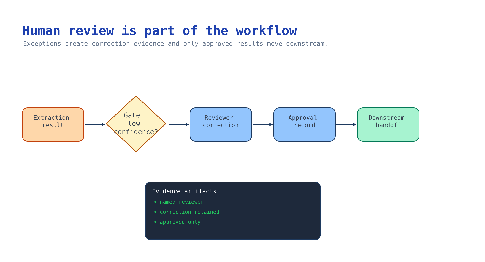

# Module 5 — Build review, correction, and handoff

Module 4 raises exceptions; this module resolves them. A reviewer sees the low-confidence and missing
fields, corrects them, and approves — and every correction is retained as evidence, so it never
silently overwrites the extraction and it feeds the evaluation in module 6.



## What you build

1. A review queue: exceptions routed to a named reviewer with the document, the extracted fields, and
   the grounding evidence beside each one.
2. A correction record: field, original value, corrected value, and reason — kept, not overwritten.
3. A governed handoff: approved results cross one seam to the downstream system, as the workflow
   identity, with an auditable trace. Reference:
   [`accelerator/sample-data/workflow/approval-trace.json`](../accelerator/sample-data/workflow/approval-trace.json).

## Choose your path

| Option | Reviewer surface | Handoff mechanism | Build effort | Best when |
| --- | --- | --- | --- | --- |
| **A. Action tool handoff** *(default)* | Any queue/app that reads the result | Agent calls an approved action tool (API/MCP) to post the result | Low–medium | You are building on the Foundry agent stack |
| B. Human-in-the-loop review app | Purpose-built correction UI over the result | App writes back the approved result | Medium–high | Reviewers need a rich correction experience |
| C. Multi-agent workflow handoff | Upstream agent hands the case to a reviewer/approver agent | Workflow transition with state | Medium | You already run a multi-agent workflow |

**Default: Option A.** The correction UI can be simple; the part that must be right is the **handoff
seam** — a single, approved action tool the agent calls to post an approved result, as the workflow
identity, with a trace. Action tools are the canonical way to do that in this kit, so you inherit
auth, schema, and observability instead of hand-rolling an integration.

**Choose B** when reviewers need a real correction experience (side-by-side document + fields,
bounding-box overlays). The handoff still goes through the same approved seam. **Choose C** when this
workflow is already one agent in a larger multi-agent system and the natural model is an explicit
handoff to an approver agent.

**Migration cost.** A → B adds a UI in front of the same seam — cheap, additive. A/B → C reshapes
orchestration but keeps the result contract and the correction record. Keep the handoff seam stable
and the rest is swappable.

## Implementation

### Option A — Action tool handoff (default)

Route exceptions to a queue, let a reviewer correct them, then post the approved result through one
action tool. The correction is recorded **before** the handoff and never mutates the original result:

```python
def apply_correction(result, field, corrected_value, reviewer_id, reason):
    original = result["fields"][field]["value"]
    correction = {"field": field, "original_value": original,
                  "corrected_value": corrected_value, "reason": reason}
    # New reviewed copy — the original extraction is retained as evidence.
    reviewed = {**result, "fields": {**result["fields"],
                field: {**result["fields"][field], "value": corrected_value, "corrected": True}}}
    trace = {"document_id": result["document_id"], "reviewer_id": reviewer_id,
             "reviewed_at": _utcnow(), "review_outcome": "approved_with_correction",
             "corrections": [correction],
             "handoff": {"target_seam": "procurement_posting_action_tool", "approved": True}}
    return reviewed, trace
```

Then hand off through the approved tool, keylessly, as the workflow identity — build and register the
tool in the canonical [Action Tools activity](../../../activities/advanced-action-tools/README.md).
The agent calls exactly one tool to post; it cannot write anywhere else.

### Option B — Human-in-the-loop review app

Give reviewers the document with the grounding overlay and the fields, editable where flagged. On
approve, the app writes the same correction record and calls the same handoff seam. Everything you
must retain — reviewer identity, timestamp, before/after, reason — is captured by the app, so
the trace is identical to Option A. The difference is reviewer experience, not the contract.

### Option C — Multi-agent workflow handoff

If this workflow is one agent among several, model review as an explicit handoff: the extraction agent
transitions the case to an approver agent, which owns the correction and the approval. The state that
crosses the handoff is the typed result plus the correction record. Approval still ends in the same
action-tool seam. This is the pattern the
[Deploy as a Hosted Agent activity](../../../activities/advanced-deploy-hosted-agent/README.md) builds
on when the workflow ships.

## Verify

Check the trace your review step actually wrote, then check who is allowed to trigger the handoff.
Write the approval trace to `trace.json` and inspect it.

**1. The correction is retained, not an overwrite.**

```bash
jq 'select(.review_outcome == "approved_with_correction")
    | {reviewer: .reviewer_id, at: .reviewed_at,
       corrections: [.corrections[] | {field, original_value, corrected_value, reason}],
       seam: .handoff.target_seam, approved: .handoff.approved}' trace.json
```

Every correction must show a `reviewer_id`, a `reviewed_at`, a `reason`, and an `original_value` that
differs from `corrected_value`. If `original_value` is absent or equal to the corrected one, the
reviewer's change overwrote the extraction and the before/after evidence is gone — module 6 reads
these records as test cases, so a silent overwrite also poisons your evaluation set.

**2. The handoff refuses a caller who is not an approver.**

Call the approved action-tool seam as an identity that lacks the approver role:

```bash
TOKEN=$(az account get-access-token --resource "$ACTION_API_URL" --query accessToken -o tsv)
curl -s -o /dev/null -w '%{http_code}\n' -H "Authorization: ******" \
  -X POST "$ACTION_API_URL/post-approved-result" -d @trace.json -H "Content-Type: application/json"
```

A non-approver identity must get `401` or `403`. A `200` means anyone who can reach the seam can post
an approved result to the downstream system — the review gate is decorative. Grant the approver role
only to reviewer identities; never widen the seam to make a test pass.

**3. The post is attributed to the workflow identity.**

In the downstream system (or its Application Insights traces), confirm the approved result arrived
once, stamped with the workflow identity and the `document_id`, not the reviewer's personal account.
If the post shows up as the app's shared identity for every case, you cannot tell who approved what.

## Troubleshooting

| Symptom | Cause | Fix |
| --- | --- | --- |
| Correction overwrote the original result | Mutated the extraction in place | Keep the original; write a separate correction record and a reviewed copy |
| Handoff posts as the app for everyone | Service identity used instead of the workflow identity with a scoped tool | Post through one approved action tool; scope its permissions |
| Approval has no reviewer identity | Trace built without the signed-in reviewer | Require reviewer id + timestamp before the handoff is allowed |
| Reviewer approves without seeing evidence | Queue shows values but not grounding | Surface the grounding span/region beside each flagged field |
| Corrections never reach evaluation | Records discarded after handoff | Persist correction records; module 6 reads them as evaluation evidence |
| Anyone can trigger the handoff | Seam not access-controlled | Restrict the action tool to approver identities |

## Decision record

Short: the reviewer surface, the single handoff seam and who may trigger it, where correction records
are stored and for how long, and the denial/return path. One paragraph, with a date.

## Next module

[Module 6 — Evaluate and trace the workflow](06-prove-and-observe.md) turns the corrections you just
retained into an evaluation gate and reviewable traces.
