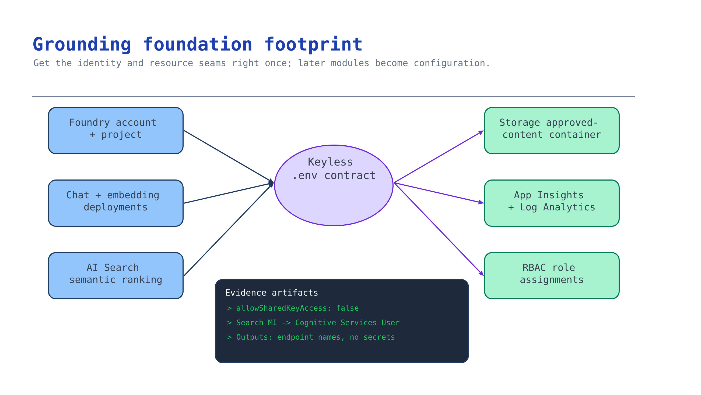

# Module 1 — Provision the grounding foundation

Every later module writes into the footprint you create here. Get the identity model right now and
modules 2–7 are configuration; get it wrong and you will redeploy.



## What you build

A resource group containing:

| Resource | Why grounding needs it |
| --- | --- |
| Foundry account (`AIServices`) + project | Hosts models, agents, and the connections everything else uses |
| Chat deployment | Answers questions **and** performs agentic query planning |
| Embedding deployment | Vectorizes approved content for vector/hybrid retrieval |
| Azure AI Search (semantic ranking on) | Backs the knowledge base and agentic retrieval pipeline |
| Storage account + `approved-content` container | The approved corpus a blob knowledge source ingests |
| Log Analytics + Application Insights | Traces and evaluation correlation from module 7 |
| Role assignments | Keyless access between search, project, models, and storage |

Output: a `.env` contract with **no secrets in it**, consumed by every later module.

## Choose your path

| Option | Reproducible | Creates embedding + storage | Best when | Cost while idle |
| --- | --- | --- | --- | --- |
| **A. Scenario Bicep** *(default)* | Yes, reviewable IaC | Yes | You are building this scenario for a customer | Search basic + Log Analytics + idle model deployments |
| B. `azd up` (kit root infra) | Yes | No — chat + Search only, no storage/embedding | You are running the whole starter kit end to end | Same, plus ACR |
| C. Foundry portal | No | Manual | A throwaway demo, or a free-tier Search proof of concept | Lowest; free Search tier possible |
| D. Bring your own landing zone | Customer's IaC | Depends on what exists | The customer already has governed Foundry + Search | Already owned |

**Default: Option A.** It is the only path that provisions *both* an embedding deployment and the
approved-content container, which modules 3–5 require, and it produces a diff a customer's platform
team can review.

**Migration cost.** A → D is cheap: modules 2+ only read the `.env` contract, so pointing at
customer resources is a variable change. C → A is expensive: portal-created resources have
generated names and no template, so you rebuild. Do not demo from C and then promise A.

### Region and model availability come first

Agentic retrieval is not available in every region, and your chat/embedding models must be
deployable in the region you pick. Check both **before** deploying:

```bash
# Regions that support agentic retrieval: see the region-support doc below.
# Confirm your chosen models are available in the target region:
az cognitiveservices account list-skus --location eastus2 --kind AIServices -o table
```

- Agentic retrieval region support: <https://learn.microsoft.com/azure/search/search-region-support>
- Query-planning models supported by a knowledge base: `gpt-4o`, `gpt-4o-mini`,
  `gpt-4.1`, `gpt-4.1-mini`, `gpt-4.1-nano`, `gpt-5`, `gpt-5-mini`, `gpt-5-nano` on
  `2025-11-01-preview` and `2026-05-01-preview`; `gpt-5.1`, `gpt-5.2`, `gpt-5.4`, `gpt-5.4-mini`,
  `gpt-5.4-nano` on `2026-05-01-preview` only —
  <https://learn.microsoft.com/azure/search/agentic-retrieval-how-to-create-knowledge-base>

> **Search tier matters.** The free tier cannot use a managed identity to reach your models. Use
> **Basic or higher** for anything past a portal demo.

## Implementation

### Option A — Scenario Bicep (default)

The template is [`accelerator/main.bicep`](../accelerator/main.bicep); defaults live in
[`accelerator/parameters.example.json`](../accelerator/parameters.example.json).

```bash
az login
az account set --subscription "<subscription-id>"

# Compile before you deploy — catches schema errors without touching Azure.
bicep build scenarios/ai-grounding/accelerator/main.bicep --stdout > /dev/null

./scenarios/ai-grounding/accelerator/scripts/deploy.sh rg-ai-grounding eastus2
```

`deploy.sh` creates the resource group, runs `az deployment group validate` first, deploys, then
writes `accelerator/.env` from the template outputs. It passes your signed-in object ID as
`principalId` so you get keyless data-plane access without anyone issuing you a key.

What the template does that matters, and why:

```bicep
// Keyless-first: shared key access is OFF, so ingestion must use Entra ID.
allowSharedKeyAccess: false

// Semantic ranking is required by agentic retrieval.
semanticSearch: 'standard'

// Search calls your embedding/chat models during ingestion and query planning,
// so its managed identity needs Cognitive Services User on the Foundry account.
resource searchToFoundryRole 'Microsoft.Authorization/roleAssignments@2022-04-01' = {
  scope: foundry
  properties: {
    principalId: search.identity.principalId
    roleDefinitionId: roleCognitiveServicesUser
  }
}
```

To deploy into an existing resource group without creating one, skip the script:

```bash
az deployment group create \
  --resource-group <existing-rg> \
  --template-file scenarios/ai-grounding/accelerator/main.bicep \
  --parameters @scenarios/ai-grounding/accelerator/parameters.example.json \
  --parameters principalId="$(az ad signed-in-user show --query id -o tsv)"
```

### Option B — `azd up` (kit root infra)

Use when you want the shared footprint every activity in the kit uses.

```bash
azd auth login
azd up          # provisions infra/main.bicep + infra/resources.bicep
azd env get-values > scenarios/ai-grounding/accelerator/.env
```

The root infra provisions Foundry + project + **chat** deployment + AI Search + observability + ACR.
It does **not** create an embedding deployment or the approved-content container. Add them before
module 3:

```bash
RG=$(azd env get-value AZURE_RESOURCE_GROUP)
ACCOUNT=$(azd env get-value AZURE_AI_FOUNDRY_NAME)

az cognitiveservices account deployment create \
  --resource-group "$RG" --name "$ACCOUNT" \
  --deployment-name embedding \
  --model-name text-embedding-3-large --model-version 1 --model-format OpenAI \
  --sku-name Standard --sku-capacity 30

az storage account create --resource-group "$RG" --name "st${RANDOM}grnd" \
  --sku Standard_LRS --allow-shared-key-access false
```

Then append `AZURE_AI_EMBEDDING_DEPLOYMENT_NAME`, `AZURE_STORAGE_ACCOUNT_NAME`, and
`AZURE_STORAGE_CONTAINER_NAME` to the `.env` file.

### Option C — Foundry portal

For a same-day demo or a zero-cost proof of concept.

1. Open <https://ai.azure.com> and make sure the **New Foundry** toggle is on.
2. Create a project. A Foundry account is created for you.
3. **Build → Models** — deploy one chat model and one embedding model.
4. **Build → Knowledge** — create or connect a search service that supports agentic retrieval.
   The portal offers a free Search tier for proof-of-concept work.
5. Record the project endpoint and deployment names into `accelerator/.env` by hand.

Accept the trade: no template, generated names, nothing for a platform team to review, and the
free Search tier cannot use managed identity for model access. Treat anything built here as
disposable.

### Option D — Bring your own landing zone

No new resources. You verify what exists and fill the same contract.

```bash
# Discover what the customer already has.
az cognitiveservices account list --query "[?kind=='AIServices'].{name:name,rg:resourceGroup,loc:location}" -o table
az search service list --query "[].{name:name,rg:resourceGroup,sku:sku.name,semantic:properties.semanticSearch}" -o table
```

Then confirm the four things this scenario actually depends on:

1. The Foundry account has `allowProjectManagement: true` (otherwise it is not a Foundry account).
2. Search is **Basic or higher** with semantic ranking enabled.
3. Search's managed identity holds **Cognitive Services User** on the Foundry account.
4. Your identity holds **Search Service Contributor** and **Search Index Data Contributor**.

```bash
# Check 1
az cognitiveservices account show -g <rg> -n <account> --query properties.allowProjectManagement

# Check 3 — assign if missing
SEARCH_MI=$(az search service show -g <rg> -n <search> --query identity.principalId -o tsv)
az role assignment create --assignee-object-id "$SEARCH_MI" --assignee-principal-type ServicePrincipal \
  --role "Cognitive Services User" \
  --scope $(az cognitiveservices account show -g <rg> -n <account> --query id -o tsv)
```

Write the discovered values into `accelerator/.env` using the same variable names the template
outputs, so modules 2–7 are identical across all four options.

## Verify

Three things should be true before you build on this foundation. Check each against your own
resources.

**1. Both model deployments exist.**

```bash
az cognitiveservices account deployment list \
  --name "$AZURE_AI_SERVICES_NAME" --resource-group "$AZURE_RESOURCE_GROUP" \
  --query "[].name" -o tsv
```

You should see the names you set for `AZURE_AI_MODEL_DEPLOYMENT_NAME` and
`AZURE_AI_EMBEDDING_DEPLOYMENT_NAME`. If either is missing, the later modules will fail with a
deployment-not-found error that looks like a code bug but isn't.

**2. Search answers your Entra identity, with no key anywhere.**

```bash
TOKEN=$(az account get-access-token --scope https://search.azure.com/.default --query accessToken -o tsv)
curl -s -H "Authorization: Bearer $TOKEN" \
  "$AZURE_SEARCH_ENDPOINT/indexes?api-version=2024-07-01" | head -c 200
```

A `200` with a JSON body means role-based access is working. A `403` means your account is missing
**Search Service Contributor** or **Search Index Data Contributor** — grant the role rather than
falling back to an admin key, or you will carry that key all the way to production.

**3. The environment contract holds no secrets.**

```bash
grep -iE 'api_key|account_key|connection_string|sas_token' scenarios/ai-grounding/accelerator/.env
```

No output is the result you want. Any match means something upstream handed you a key, and the
keyless chain is already broken.

## Troubleshooting

| Symptom | Cause | Fix |
| --- | --- | --- |
| `401` / `403` from Search | Your identity lacks data-plane roles; RBAC takes a few minutes to propagate | Assign **Search Service Contributor** + **Search Index Data Contributor**, wait ~5 min, re-run |
| Deployment fails on the model | Model or capacity unavailable in the region | `az cognitiveservices account list-skus --location <region> --kind AIServices -o table`, then change region or lower `chatModelCapacity` |
| Both deployments fail together | Deployments on one account serialize | The template already sets `dependsOn` on the embedding deployment; do not remove it |
| `StorageAccountAlreadyTaken` | `resourceToken` collides globally | Pass a different `resourceToken` (5–12 lowercase chars) |
| Search MI can't reach models later | Free tier, or missing **Cognitive Services User** | Move to Basic+, assign the role |
| `.env` written but empty | Deployment succeeded with no outputs | Check `accelerator/.deployment-outputs.json`; re-run the deployment |

## Decision record

Record and keep: chosen option and why, region and the availability evidence behind it, chat and
embedding model + version, Search tier, whether local auth is disabled, and who owns the resource
group. One short paragraph and the `.env` variable names — not the values.

## Next module

[Module 2 — Select the source and permission architecture](02-source-and-permission-architecture.md)
decides where trusted content comes from and whose permissions apply at query time.
