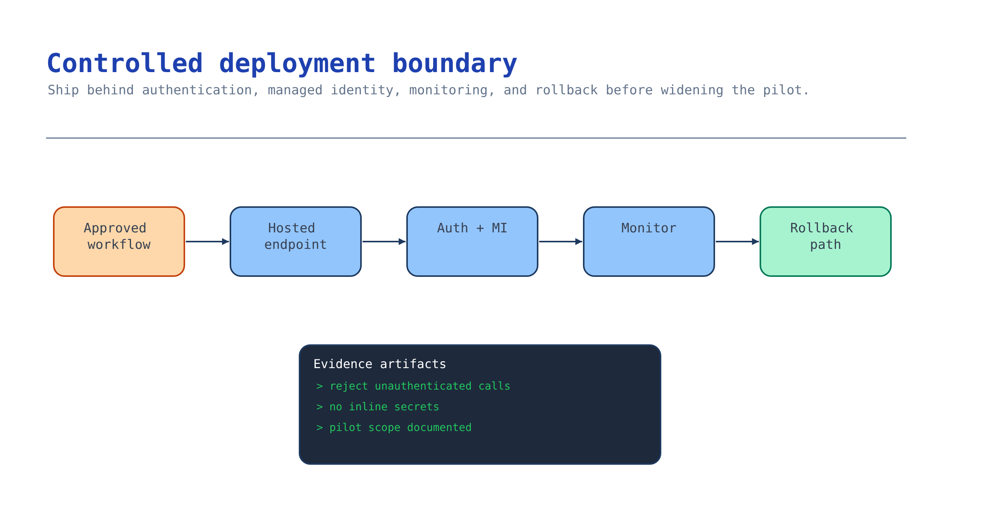

# Module 7 — Deploy the reviewable workflow

The workflow passed the gate; now ship it without losing anything that made it safe. Deployment is
where keyless auth, monitoring, and rollback stop being slideware and become the difference between a
pilot you can operate and one you cannot.



## What you build

An authenticated endpoint running the reviewed workflow with a managed identity, Application Insights
monitoring with GenAI tracing on, and a rollback path — captured as
[`accelerator/sample-data/workflow/deploy-manifest.json`](../accelerator/sample-data/workflow/deploy-manifest.json)
and confirmed by observing that the endpoint rejects unauthenticated calls.

## Choose your path

| Option | Runtime | Identity + auth | Rollback | Best when |
| --- | --- | --- | --- | --- |
| **A. Hosted agent (`azd ai agent`)** *(default)* | Foundry-hosted container | Managed identity, authenticated endpoint | Pin/swap revision | You built on the Foundry agent stack |
| B. Container app / managed online endpoint | Your container | Managed identity + Entra auth | Revision or blue/green | You need custom runtime or scaling control |
| C. API behind API Management | Your API | Entra-validated via APIM | Deployment slots | You are fronting an existing API estate |

**Default: Option A.** The workflow is already a Foundry agent with an approved action-tool seam; a
hosted agent keeps the managed identity, auth, and tracing wiring you built rather than re-creating
it. It is the shortest path from "passed the gate" to "running behind auth".

**Choose B** when you need a custom runtime, specific scaling, or network isolation the hosted option
doesn't give you. **Choose C** when this workflow must live behind an existing API Management estate
and inherit its policies. All three keep the same rule: **no keys**, managed identity, authenticated
endpoint, monitoring on, rollback ready.

**Migration cost.** A → B/C re-hosts the same container and identity model; the workflow, action-tool
seam, and evaluation gate are unchanged. The manifest you record is identical across all
three — only the runtime line differs. That is deliberate: the deployment target is a late, reversible
decision.

## Implementation

### Option A — Hosted agent (default)

Ship the reviewed workflow as a hosted agent with a managed identity and an authenticated endpoint,
keeping GenAI tracing on. Build and deploy it with the canonical
[Deploy as a Hosted Agent activity](../../../activities/advanced-deploy-hosted-agent/README.md), which
covers `agent.yaml`, `azd ai agent`, per-agent Entra identity, and the dedicated endpoint. Carry the
same tracing env into the deployment:

```bash
export AZURE_EXPERIMENTAL_ENABLE_GENAI_TRACING=true
export OTEL_INSTRUMENTATION_GENAI_CAPTURE_MESSAGE_CONTENT=true
```

Record the deployment facts (auth mode, managed identity, monitoring, rollback strategy, and that the
module-6 gate passed) into `deploy-manifest.json`.

### Option B — Container app / managed online endpoint

Run the same container yourself with a system-assigned managed identity and Entra authentication on
the ingress. Point Application Insights at it (the connection is already a project connection from
module 1) and keep two revisions so rollback is a revision swap, not a redeploy. The action-tool seam
and the workflow identity are unchanged — you are only changing where the container runs.

### Option C — API behind API Management

Front the workflow with an API and let API Management validate Entra tokens before the request
reaches it. Use deployment slots for rollback. This suits an organization standardizing every AI
endpoint behind one gateway; you inherit APIM's throttling, logging, and policy at the cost of one
more hop.

## Verify

```bash
# Structure only
python3 scenarios/content-understanding/accelerator/scripts/verify_deploy.py --offline

# Live: confirm the deployed endpoint rejects an unauthenticated call
python3 scenarios/content-understanding/accelerator/scripts/verify_deploy.py \
  --endpoint https://<your-endpoint>
```

Expected:

```
✅ Module 7 checkpoint PASS — the deployment manifest contract is complete
```

The offline check asserts Entra auth with a managed identity and no keys, an authenticated endpoint,
Application Insights with GenAI tracing on, a defined rollback strategy, module-6 gate status, and
retained evidence references. The live probe expects a `401`/`403` from an unauthenticated request.

## Troubleshooting

| Symptom | Cause | Fix |
| --- | --- | --- |
| Live probe returns `200` unauthenticated | Endpoint not protected | Require Entra auth on ingress; never expose the workflow anonymously |
| Deployment can't reach models or storage | Managed identity missing roles | Re-assign **Cognitive Services User** / **Storage Blob Data Reader** to the deployment identity |
| No traces after deploy | Tracing env not carried into the runtime | Set both GenAI env vars in the deployment, before the SDK loads |
| Rollback means a full redeploy | No revision/slot retained | Keep the previous revision pinned; make rollback a swap |
| Manifest still lists module 6 as not passed | Shipping before module 6 passed | Do not deploy until the gate is green; it is a release prerequisite |
| Secrets appear in the deployment config | Key-based auth crept back in | Return to managed identity; scan config for `*_KEY` / connection strings |

## Decision record

Short: the runtime you chose and why, the endpoint auth model, the monitoring and trace destination,
the rollback mechanism, and the release approver. One paragraph, with a date — this is the pilot
release record.

## Next module

You have completed the seven-module path — a reviewable, evidence-backed document workflow. Start the
next document decision at [Module 1](01-provision-foundation.md), or extend this workflow into a
multi-agent system with the [Capstone activity](../../../activities/capstone-multi-agent/README.md).
